# BMW iDrive library
Uses an ESP32 DevKit and TJA 1055 CAN driver to interface with a BMW E65 iDrive controller.
I've partially reverse-engineered the protocol but make no promises about the accuracy. It seems to work for me.


# Notes
Below are the unedited notes I took while investigating the controller. They point at lots of other resources and might be useful to someone else looking into these devices.

https://en.wikipedia.org/wiki/IDrive
Early versions (7-series E65 etc) used [Immersion’s Touch Sense Programmable Haptic Rotary Encoders](https://web.eecs.umich.edu/~jfr/embeddedctrls/files/TSRotary_Oct04_v3_LR.pdf), in particular the [PR-3000](https://web.eecs.umich.edu/~jfr/embeddedctrls/files/TSRotary_Oct04_v3_LR.pdf).

## Relevant links

- https://github.com/Autohome2/idrive-controller for ZE 9317695-02 CAN bus connected 4-pin iDrive controller (2014 BMW 2 series F20 F21)
- https://github.com/egisz/bmw-idrive-keyboard uses BMW F10 CAN bus connected iDrive controller
- https://github.com/jegb/iDrive_knob for a non-descript CAN bus connected iDrive controller
- https://github.com/jamesfoley/idrive-bluetooth has another CAN bus connected iDrive controller with media/menu/radio/tel buttons
- https://github.com/thatdamnranga/iDrive for another CAN bus connected iDrive controller, with touch events
- https://github.com/IAmOrion/BMW-iDrive-BLE-HID also uses a touch-enabled iDrive controller
- https://github.com/hufman/IDriveConnectKit talks about communicating with (modern) iDrive using the Apache Etch RPC protocol. This library is used here https://github.com/hufman/AndroidAutoIdrive
- https://github.com/kmalinich/node-bmw-client says it talks to K-CAN and K-CAN2 iDrive controllers; it decodes 0x0BF for the touchpad, 0x264 for rotation 0x267 for buttons, 0x273 for init, 0x277 for ack and 0x4e7 and 0x5e7 for status updates.
- https://github.com/pavelmalik/BMWCanBridge has a bunch of CAN messages for e60
- https://community.particle.io/t/photon-to-bmw-idrive-controller-canbus/47643 discusses how to initialize the CAN bus controller in 4-pin iDrive controllers (e.g. F30 6582 9286699-03)
    - Links to https://github.com/JumpMaster/particle-idrive
- https://www.bimmerfest.com/threads/e90-ccc-and-cic-to-nbt-retrofit-diy.799458/ talks about retrofitting CCC to NBT but I can’t seem to find wiring info on the old controller

## Device #1 (E65)

<table>
<tr>
<td>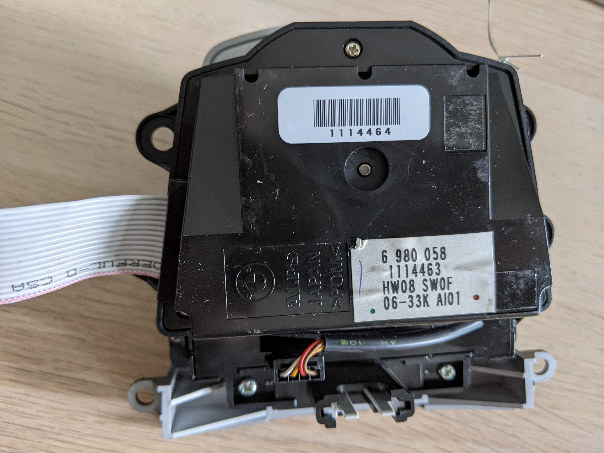</td>
<td>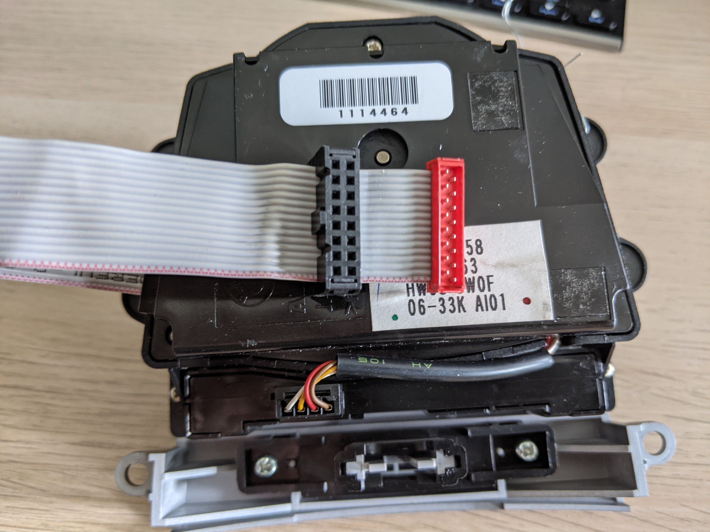</td>
</tr>
</table>

BMW 7 series E65 iDrive controller with haptic feedback. Has a sticker that says:

```
6980058
1114463
HW08 SW0F
06-33K AI01
```

6980057 would be the front controller, -58 is the rear seats.
There’s another sticker with barcode that reads 1114464.
The device is externally connected using a 16-pin connector. As that connector is hard to come by I crimped a regular 16-pin IDC connector to the cable.
It also has a 4-pin connector internally between the menu/home button panel and the main unit


## Device #2 (E60)

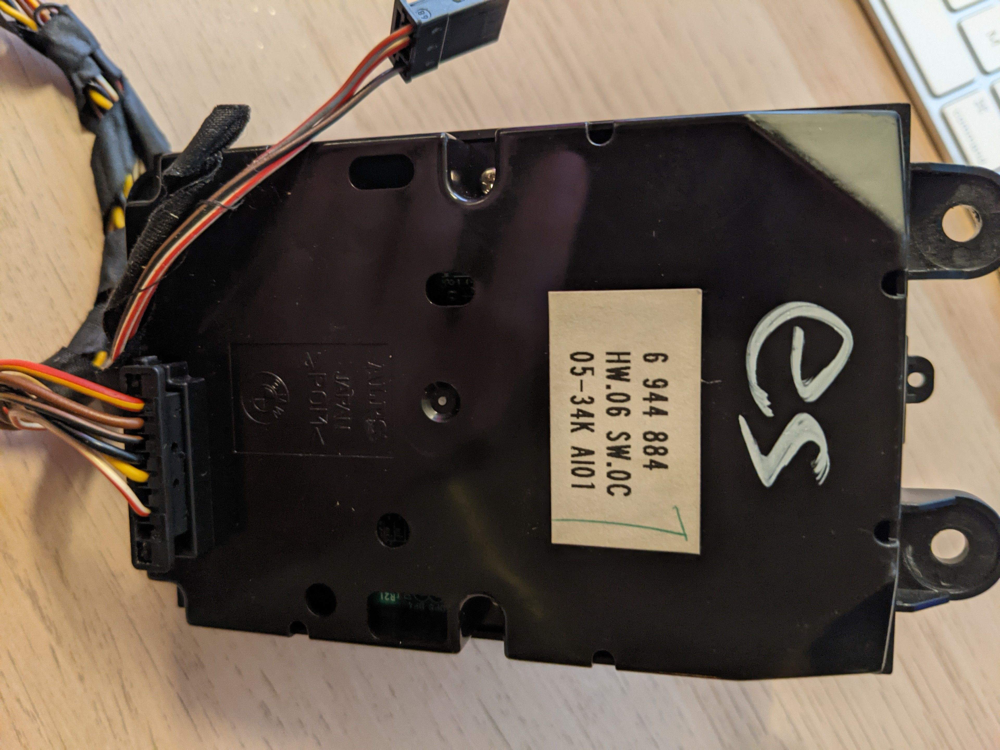

BMW 5 series E60 iDrive controller without haptic feedback. Has a sticker that says:

```
6944884
HW.06 SW.0C
05-34K AI01
```

It’s made by ALPS and has an 8-pin connector from which only 6 cables are connected. Looking at it from the back with the writing right way up, the pinout is (left to right):

- 1 = 12v
- 2 = gnd
- 4 = black = CAN H (normally green)
- 5 = yellow = CAN L (normally yellow)

## More Info on the E65 controller

[This PDF](https://www.meeknet.co.uk/E64/08_E65%20iDrive%20Comfort%20Area.pdf) talks about the iDrive controller (CON) and how it works.

> Inside the Controller there is a DC motor which is controlled by pulse-width modulation (PWM) signals. That motor generates a rotational force opposite to the direction of rotation. That opposing force or torque is perceived by the user as a mechanical resistance.
> 
> The Controller is connected directly to the BZM by a 16-wire ribbon cable.
> 
> The BZM has no connection with the functions of the Controller. The bus leads from the K-CAN-S to the Controller are simply looped through the BZM.

[This PDF](https://share.qclt.com/bmw%E8%B5%84%E6%96%99/ICT/English/Participant_manual/mfp-brk-e65-idrive-conn-servic-en.pdf) further explains


> The positive and earth connections to the controller are split between three separate leads in order to keep the continuous current load at the connector within the permissible limits.

[PR-3000 specs](https://web.eecs.umich.edu/~jfr/embeddedctrls/files/TSRotary_Oct04_v3_LR.pdf) say it may draw up to 27W (2.25A @ 12V).

On my 16-pin connector for the E65 controller (below) pins 4, 5, and 6 are connected together, as are pins 10, 11, and 12. By continuity testing against all of the exposed screws I found that the second triplet is ground.

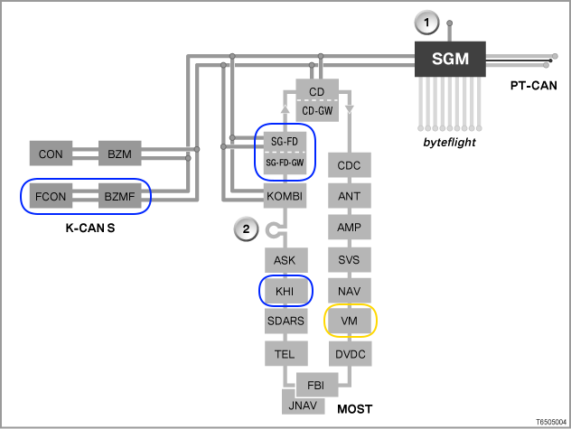

[Here](https://www.bmw-rudel.de/index.php/bmw-e66/nachruestungen/sa603-fond-entertainment) it says that iDrive controllers in front and back would talk to the center console control center (BZM) over K-CAN S.

> Der iDrive-Contorller wird am Schaltzentrum in der Fondarmlehne angeschlossen. Wenn man elektrische Sitze hinten hat, muss man hier nichts weiter machen, der iDrive-Controller hängt am K-CAN-S Bus.

This [PDF of the E65 bus systems](http://www.xolmatic.com/xprojects/XE65/MOST/bus%20system.pdf) talks about K-CAN among other things.

> If the CAN High voltage level changes from low to high, this represents a logical 1. If the voltage level changes back to low, this represents a logical 0. The voltage level on the CAN is in the range of 1V to 5V.

## Wiring

```
PIN 1 - 0V
PIN 2 - CAN L (5.1V recessive, 0.8V dominant) idles at 11.7V (!) after messages are done
PIN 3 - CAN H (0.25V recessive, 4.4V dominant)
PIN 4+5+6 = 12v
PIN 7
PIN 8
PIN 9
PIN 10+11+12 = GND
PIN 13
PIN 14
PIN 15
PIN 16 - 0V
```

In 2018 someone had apparently successfully interfaced with it using a Teensy 3.2, but I’m not convinced they’re actually talking about an E65 iDrive controller? I found this through a google image search result that shows my E65 iDrive controller but the pinout seems not to match mine very well?

I looks like pins 2+3 are CAN bus; most likely low-speed. 

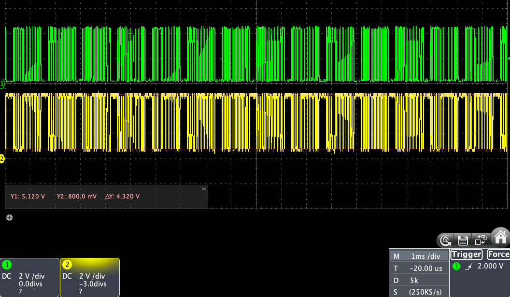
Pins 2 (yellow) and 3 (green), note 3 div offset.

Oddly, there are only messages immediately after power up; afterwards CAN H remains at 0.25V but CAN L goes to 11.7V - this might be because termination isn’t right? Actually, in this datasheet for the TJA1055 it lists this behaviour as low-power mode (graph on page 17)

[Wikipedia](https://en.wikipedia.org/wiki/CAN_bus) says:

> *ISO 11898-3*, also called low-speed or fault-tolerant CAN (up to 125 kbit/s), uses a linear bus, star bus or multiple star buses connected by a linear bus and is terminated at each node by a fraction of the overall termination resistance. The overall termination resistance should be close to, but not less than, 100 Ω.
> 
> Low-speed fault-tolerant CAN signaling operates similarly to high-speed CAN, but with larger voltage swings. The dominant state is transmitted by driving CANH towards the device power supply voltage (5 V or 3.3 V), and CANL towards 0 V when transmitting a dominant (0), while the termination resistors pull the bus to a recessive state with CANH at 0 V and CANL at 5 V. This allows a simpler receiver which just considers the sign of CANH−CANL. Both wires must be able to handle −27 to +40 V without damage.

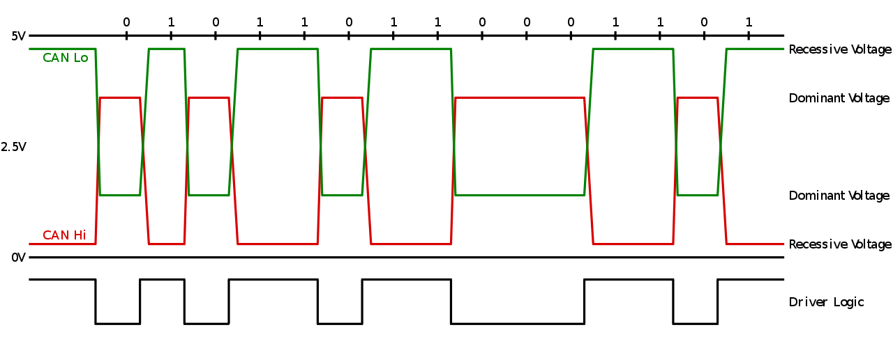

## CAN bus hardware/transceivers

[This](https://www.electronicshub.org/arduino-mcp2515-can-bus-tutorial/) seems like a reasonable introduction and uses the same board that I have (MCP2515 + TJA1050T). Sadly it turns out that board only speaks high-speed CAN.

The [Arduino-MCP2515 library](https://github.com/autowp/arduino-mcp2515/blob/master/README.md) suggests using a TJA1055 for low speed fault-tolerant CAN. It seems hard to find ready-made boards that use this chip. [Here](http://www.can-wiki.info/doku.php?id=can_physical_layer:can_transceivers) is an exhaustive list of CAN transceivers but it’s somewhat hard to figure out which ones would support low speed.

[Here](https://www.hackster.io/databus100/digital-speedometer-to-car-s-instrument-cluster-via-can-bus-66e273) someone is interfacing with their low-speed CAN bus using a TJA 1055 behind an MCP2515 on a custom PCB. The author says the (TJA1055 Application Hints)[https://www.nxp.com/docs/en/application-note/AH0801.pdf] were useful. Page 20 shows a “typical circuit” for 3V applications.

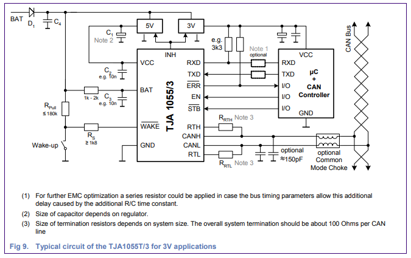

The ESP32 speaks CAN natively (they call it [TWAI](https://docs.espressif.com/projects/esp-idf/en/latest/esp32/api-reference/peripherals/twai.html)), as long as the messages are [classical CAN](https://automotive.softing.com/standards/bus-systems/can-fd-iso-11898-1.html) (carry at most 8 bytes of data), which seems fine.

Based on the application hints the minimum components I can get away with are:

| TJA1055/3 pin | Notes                                                                                                                                                 |
| ------------- | ----------------------------------------------------------------------------------------------------------------------------------------------------- |
| 1 (INH)       | unconnected; it’s an BAT-referenced output pin to control voltage regulators                                                                          |
| 2 (TXD) ✅     | to CTX (GPIO 5 in default arduino-CAN) to G25                                                                                                         |
| 3 (RXD) ✅     | to CRX (GPIO 4 in default arduino-CAN) to G33, ** needs 3.3V pull-up (suggested 3.3k Ohm, but can try to use ESP32 software pull-ups?) -- I used 4.7k for now** |
| 4 (ERR_N)     | used to indicate an error, a wake-up or a power-on flag, needs 3.3V pull-up                                                                           |
| 5 (STB_N) ✅   | 3.3V. STB_N=1 and EN=1 enables normal mode                                                                                                            |
| 6 (EN) ✅      | 3.3V. STB_N=1 and EN=1 enables normal mode                                                                                                            |
| 7 (WAKE_N) ✅  | Connect to BAT (12V). Pulling low triggers wake-up event but is not needed.                                                                           |
| 8 (RTH) ✅     | 500 Ohm (used 470 Ohm) terminator resistor connection for CANH                                                                                        |
| 9 (RTL) ✅     | 500 Ohm (used 470 Ohm) terminator resistor connection for CANL                                                                                        |
| 10 (VCC) ✅    | 5V (!)                                                                                                                                                |
| 11 (CANH) ✅   | CAN H to iDrive                                                                                                                                       |
| 12 (CANL) ✅   | CAN L to iDrive                                                                                                                                       |
| 13 (GND) ✅    | GND                                                                                                                                                   |
| 14 (BAT) ✅    | 1k Ohm to 12V                                                                                                                                         |

Schematic on [EasyEDA](https://easyeda.com/editor#id=b569ebeedd104509b7dd63f1caa1d493).

When putting 470 Ohm resistors between 8 and 11 as well as 9 and 12, and 1k between 7 and 14, and 4.7k between 3 and 5+6 (which are connected together), we end up with the following connections:

- 2 = TX GPIO
- 3 = RX GPIO
- 5 = 3.3V
- 7 = 12V
- 10 = 5V
- 11 = CAN H (normally green)
- 12 = CAN L (normally yellow)
- 13 = GND

## CAN bus software/messages
The arduino-CAN library seems to support the ESP32 controller out of the box.
When waking up I get a series of messages; those repeat when I send any (?) command:

```
Received packet with id 0x4E8 and length 8: 68 1 FE FF FF FF FF FF 
Received packet with id 0x4E8 and length 8: 68 2 FE FF FF FF FF FF 
Received packet with id 0x4E8 and length 8: 68 1 FE FF FF FF FF FF 
Received packet with id 0x4E8 and length 8: 68 2 FE FF FF FF FF FF 
Received packet with id 0x4E8 and length 8: 68 1 FE FF FF FF FF FF 
Received packet with id 0x4E8 and length 8: 68 2 FE FF FF FF FF FF 
Received packet with id 0x4E8 and length 8: 68 1 FE FF FF FF FF FF 
Received packet with id 0x4E8 and length 8: 68 2 FE FF FF FF FF FF 
Received packet with id 0x4E8 and length 8: 68 1 FE FF FF FF FF FF 
Received packet with id 0x4E8 and length 8: 68 14 FE FF FF FF FF FF
```

[Here](https://z4-forum.com/forum/viewtopic.php?t=108047) IamOrion (see also “relevant links”) is talking to the iDrive controller and is sending 0x501 0x273 messages, says 120 Ohm termination is needed. 0x501 is also referenced [here](https://f30.bimmerpost.com/forums/showthread.php?t=1639676&page=65).

Both of those didn’t seem to do anything. [Here](https://www.bimmerfest.com/threads/k-can2-messages-to-wake-a-cic-idrive-controller.890419/) is another post where someone attempts to send wake-up messages and they refer to id `1272` (hex 0x4F8), which is adjacent to the 0x4E8 messages I’m seeing. They don’t seem to do anything. Later in that thread someone posted details how they run their 9317695 controller off K-CAN2 by sending `0x563` and `0x273` messages in response to `0x5e7`.

[Here](https://www.bimmerfest.com/threads/k-can2-messages-to-wake-a-cic-idrive-controller.890419/) are a bunch of codes that supposedly work for newer iDrive controllers (ZBE3?), but those don’t seem to work. They are also referenced [here](https://github.com/Autohome2/idrive-controller/blob/master/non%20library%20demo/idrive_controller_demo/idrive_controller_demo.ino). Similarly, [this post](https://bluewavestudio.io/community/showthread.php?tid=2477) references a `9286699-03` 7-button no touch F10/30 iDrive with `0x563` messages to wake up and `0x273` to initialize, but those don’t do anything for my unit.

[This Github repo](https://github.com/damienmaguire/BMW-E65-CANBUS/blob/master/E65_Codes.ods) seems to have a ton of good information on CAN bus messages for the E65, including a section called “I-Drive Haptic Control”. [Loopbunny](http://www.loopybunny.co.uk/CarPC/k_can.html) also has a lot of K-CAN control messages, including iDrive, but from later models (E84 + F39).

[Here](https://www.bimmerforums.com/forum/showthread.php?2298830-E90-Can-bus-project-(E60-E65-E87-)/page3) someone has an E65 instrument cluster and wants to inject messages. They say 0x130 ignition status needs to be sent every 100ms. That doesn’t seem to make my controller send any messages.

[Here](https://github.com/pavelmalik/BMWCanBridge) it says that

> The night vision module, along with others that connect to k-bus (CIC, NBT navigation etc), is coded directly to the vin number of the original car and refuses to work if it receives another vin. Specifically, all these modules look for 7 byte long 0x380 frames that encode the last 7 digits of the vin as ascii hex values.

I wonder if the controller requires a specific VIN?

I confirmed that ID `0x202` with data `0x00FF` turns the button lights low, and that data `0xEFFF` makes them bright.

Actually, [here](https://z4-forum.com/forum/viewtopic.php?t=108047&start=30) user zions does mention messages very similar to mine (`0x4e7` rather than `0x4e8`) with data `67 02 FE FF FF FF FF FF`, which is just one off from mine…

[This post](https://www.e90post.com/forums/showthread.php?t=177272&page=6) also shows the same sequence of messages (4E7 6701FEFF…, 4E7 6702FEFF…) and the user gets sent to [this thread](https://www.e90post.com/forums/showthread.php?p=17037350#post17037350) where folks are discussing wakeup commands from the CIC. This is the second reference I’m seeing to http://www.volcano.at/iDrive (post referencing `1272`  to wake up also referenced volcano.at). The internet archive helpfully [has a copy](https://web.archive.org/web/20170923173446/http://www.volcano.at/iDrive) and it seems to reference a paper titled “BMW iDrive automotive hid device in EFIS control”. In [one of the earlier posts](https://web.archive.org/web/20161104233153/http://www.volcano.at/iDrive/?m=201412) the author makes a somewhat obscure reference to three people who helped with initialization: [Pavel Paces](http://www.pacespavel.net/), Ascanio and Martin. Ascanio is a person in that thread where they discuss wakeup commands, but they never supplied any wakeup commands…

When I send out a `0x4e8` message (length 8, data `0x68 02 FE FF FF FF FF FF`) (same that I got from the controller) I actually get a response! (only for this, though, not for the `0x68 01` version...)

```
Received packet with id 0x5E8 and length 8: 1 1 AE FF FF FF FF FF 
```

If we compare this to the `0x5e7` messages documented [here](https://www.bimmerfest.com/threads/k-can2-messages-to-wake-a-cic-idrive-controller.890419/) and [here](https://bluewavestudio.io/community/showthread.php?tid=2477), we notice that the first has `00` at the end while the second has `FF`. Either way, I tried to copy their `0x273` initialization message with various end bytes, but received no response.

There seems to be some kind of timing issue where the `0x4e8` won’t receive a response if too much (or too little?) time has passed; if I intersperse messages they can get a response. Maybe I should switch to the interrupt-driven version of that library?

[This thread](https://www.bimmerfest.com/threads/information-source-on-k-can-bus.825057/page-2) about waking K-CAN seats has other people trying to figure out how to interface with E65 seats which seem to not want to wake up. I requested help recording K-CAN messages in [this forum post](https://www.bimmerfest.com/threads/help-recording-e65-66-k-can-messages-for-idrive-haptic-controller.1412559/).

I got a response on the seat thread pointing me towards [this C# code](https://github.com/toxsedyshev/imBMW/blob/master/Sources/NET-MF/imBMW.Features/CanBus/Devices/E65Seats.cs) for talking to E65 seats. Sending those messages didn’t help elicit any response.

I also got a response saying the BZM sends `0x5E5` messages, which in turn pointed me at [this post](https://electronics.stackexchange.com/questions/323555/decoding-message-data-on-this-can-bus/333954) where I found a reference to [CANopen](https://en.wikipedia.org/wiki/CANopen#Service_Data_Object_.28SDO.29_protocol) where it appears device IDs are structured in a particular way. Not sure if the E65 uses those? `0x4E8` would then decode as function code `1001` (0x240 if filled with 7 0s, not listed in the predefined message identifiers according to Wikipedia) and node id `1101000` = 0x68. Given the many can IDs below I think it might not use CANopen. I also can’t seem to find any Google results for “E65 CANopen“. HOWEVER my 0x4E8 message starts with 0x68 so that’s suspicious…

[This thread](https://www.bimmerforums.com/forum/showthread.php?2298830-E90-Can-bus-project-(E60-E65-E87-)/page8) seems to have some detailed CAN bus data.


With both controller connected on the bus they seem to be communicating amongst each other when I send a repeated `0x130, 5, {0x05, 0xF0, 0xFC, 0xFF, 0xFF}` message:

```
Sending 130: 5 F0 FC FF FF 
     Received 4E7: 67 1 FF FF FF FF FF FF 
     Received 4E8: 68 1 FE FF FF FF FF FF 
     Received 5E7: 1 1 AA FF FF FF FF FF 
     Received 5E8: 1 1 AE FF FF FF FF FF 
     Received 4E7: 68 12 FF FF FF FF FF FF 
     Received 4E8: 67 12 FE FF FF FF FF FF 
     Received 4E7: 68 72 FE FF FF FF FF FF 
```

Looks like the E60 controller uses the more common 4E7 message. Note also that the `4E8: 68 2` message is no longer being repeated by the E65 controller.


[This post in russian](http://pccar.ru/archive/index.php/t-22942.html) talks about 4E7 as well and seems to have some good insights:

> The modules use the Philips TJA1054 CAN transceiver that has a "wakeup" output, and that is used to enable the "inhibit" input of the devices main power control device (often an Infineon TLE4262). The slave devices on the bus are always supplied with Battery Voltage and ground. Any activity on the bus therefore causes the can transceiver to enable the devices power, which powers up the onboard micro. The micro then looks for a command to "stay awake". If it doesn't receive this command, it just goes back to sleep after about 4 secs.

In there they also mention that you can in fact use high-speed CAN (e.g. MCP2551) if you connect CAN L to ground, as the TJA1055 will struggle on with the CAN H line alone, which has approximately correct levels.

In the thread someone figured out how to use the 7-button iDrive ([Dropbox video](https://www.dropbox.com/s/yz1elfc34aw6igf/iDrive%2BRemoteInputsMgr.mov?dl=0)) but that controller isn’t sending 4E7 messages. Someone else is working out how to talk to an `6979472` X5 E70 controller and they also see 4E7 and 5E7 messages. Finally IAmOrion (!) is coming along and posts suspected messages but I’m not sure those are right

```
#define MSG_OUT_ROTARY_INIT 0x123
#define MSG_OUT_DIM 0x202
#define MSG_OUT_WAKEUP 0x267 0x267 // // 0x1B8
```

In the thread kostyasha also suggests that 5E7 might be rotary state? Upon closer inspection the 5E7 message does contain `1 AA` which is listed in the E65 codes table for haptic control and some button presses... The `5E8` message says `1AE`.

Sending `1AE` messages (instead of `1AA`) seems to do something! However, the controller is either unhappy or I’m sending the messages badly as it doesn’t feel right. Given this message:

```
{0x1AE, 8, {0xF4, 0x2A, 0x00, 0x00, 0x00, 0x00, 0x00, 0x00}}
```

it starts spinning on its own! The more frequent I send the message the quicker it spins.

[Seems like](https://www.bimmerforums.com/forum/showthread.php?1984229-iDrive-Wheel-Is-Possessed-(twitches-and-turns-by-itself)) this [is](https://www.bimmerfest.com/threads/idrive-going-crazy.500239/) a [somewhat](https://www.e90post.com/forums/showthread.php?t=78847) common [problem](https://www.bimmerfest.com/threads/idrive-knob-spinning-out-of-control.674424/)? Replacing the module seems to be the solution 😞 


## Figuring out 1B8 messages

When using the “fine” setting, I’m getting messages like this when I get some haptic feedback:

```
     Received 1C0: F C0 26 FF 80 31 
     Received 1C0: F C0 A5 FE 80 31 
     Received 1C0: F C0 71 FE 80 31 
```

and like this when there’s no feedback:

```
     Received 1C0: F C0 0 0 4 F 
     Received 1C0: F C0 B 0 D F 
     Received 1C0: F C0 4B 0 1 F 
```

In [this spreadsheet](https://docs.google.com/spreadsheets/d/1jPlGHIRm8mWfoUlwfBVVgv94nHL_QYkKra740K-tANE/edit#gid=0) it says byte 3 is sensitive spin and byte 4 is rough spin. It doesn’t explain the last two bytes. In the E65 Codes sheet it says byte 3 is a counter and byte 4 is haptic jumps.

In [this Arduino sketch](https://github.com/jegb/iDrive_knob/blob/master/idrv.ino) they say 0F C0 is rotation with a little endian 2-byte number following it

```
rotate_num = (read_buffer[6] << 8) + read_buffer[5];
```

if rotate_num increases, it’s being turned right, if it decreases, it’s being turned left. In that sketch the last 4 bytes are `0x20 0x6F` but mine (when feedback works) are `0x80 0x31` and I wonder if that’s related to the “fine” setting’s last two bytes (`0x20 0x7F` for force and delta in between) — feels like it might be an inverse or so? 

When I change it to be `0x30 0x7F` the response becomes

```
     Received 1C0: F C0 2C 0 80 32 
     Received 1C0: F C0 B2 0 80 32 
     Received 1C0: F C0 D2 0 80 32 
```

When I change it to be `0x21, 0x7F` the response becomes

```
     Received 1C0: F C0 27 0 90 31 
     Received 1C0: F C0 1F 0 90 31 
```

With `0x61, 0x7F` the response becomes

```
     Received 1C0: F C0 30 FF 90 35 
     Received 1C0: F C0 12 FD 90 35 
     Received 1C0: F C0 B5 FA 90 35 
     Received 1C0: F C0 C0 F8 90 35 
```

With `0x61, 0x7E` the response becomes

```
     Received 1C0: F C0 CC FF 80 35 
     Received 1C0: F C0 77 FF 80 35 
     Received 1C0: F C0 DC FE 80 35 
     Received 1C0: F C0 6D FE 80 35 
```
With `0x61, 0x6E` the response becomes

```
     Received 1C0: F C0 10 0 80 34 
     Received 1C0: F C0 DC 0 80 34 
```

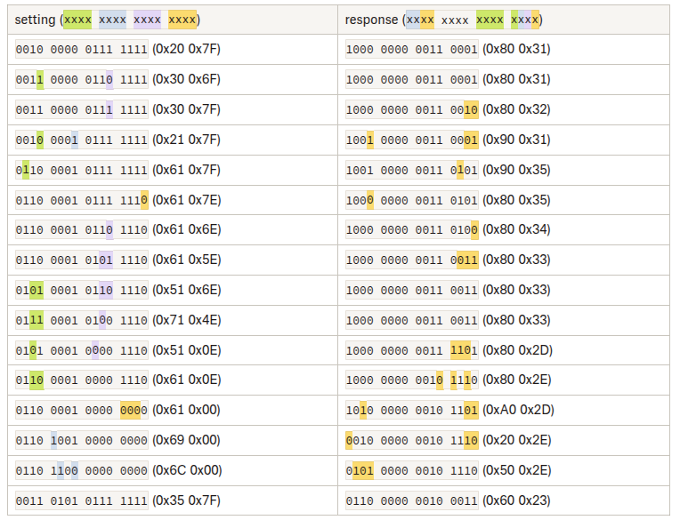

## Figuring out the handshake for the rear controller

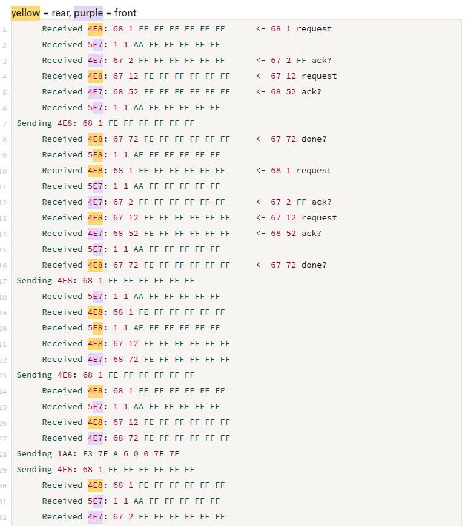

Full text preserved below (there were no further color highlights):
```
     Received 4E8: 68 1 FE FF FF FF FF FF      <- 68 1 request
     Received 5E7: 1 1 AA FF FF FF FF FF 
     Received 4E7: 67 2 FF FF FF FF FF FF      <- 67 2 FF ack?
     Received 4E8: 67 12 FE FF FF FF FF FF     <- 67 12 request
     Received 4E7: 68 52 FE FF FF FF FF FF     <- 68 52 ack?
     Received 5E7: 1 1 AA FF FF FF FF FF 
Sending 4E8: 68 1 FE FF FF FF FF FF 
     Received 4E8: 67 72 FE FF FF FF FF FF     <- 67 72 done?
     Received 5E8: 1 1 AE FF FF FF FF FF 
     Received 4E8: 68 1 FE FF FF FF FF FF      <- 68 1 request
     Received 5E7: 1 1 AA FF FF FF FF FF 
     Received 4E7: 67 2 FF FF FF FF FF FF      <- 67 2 FF ack?
     Received 4E8: 67 12 FE FF FF FF FF FF     <- 67 12 request
     Received 4E7: 68 52 FE FF FF FF FF FF     <- 68 52 ack?
     Received 5E7: 1 1 AA FF FF FF FF FF 
     Received 4E8: 67 72 FE FF FF FF FF FF     <- 67 72 done?
Sending 4E8: 68 1 FE FF FF FF FF FF 
     Received 5E7: 1 1 AA FF FF FF FF FF 
     Received 4E8: 68 1 FE FF FF FF FF FF 
     Received 5E8: 1 1 AE FF FF FF FF FF 
     Received 4E8: 67 12 FE FF FF FF FF FF 
     Received 4E7: 68 72 FE FF FF FF FF FF 
Sending 4E8: 68 1 FE FF FF FF FF FF 
     Received 4E8: 68 1 FE FF FF FF FF FF 
     Received 5E7: 1 1 AA FF FF FF FF FF 
     Received 4E8: 67 12 FE FF FF FF FF FF 
     Received 4E7: 68 72 FE FF FF FF FF FF 
Sending 1AA: F3 7F A 6 0 0 7F 7F 
Sending 4E8: 68 1 FE FF FF FF FF FF 
     Received 4E8: 68 1 FE FF FF FF FF FF 
     Received 5E7: 1 1 AA FF FF FF FF FF 
     Received 4E7: 67 2 FF FF FF FF FF FF 
Sending 4E8: 68 1 FE FF FF FF FF FF 
     Received 4E8: 67 12 FE FF FF FF FF FF 
     Received 4E8: 67 32 FE FF FF FF FF FF 
     Received 4E8: 68 1 FE FF FF FF FF FF 
Sending 4E8: 68 1 FE FF FF FF FF FF 
     Received 4E8: 67 12 FE FF FF FF FF FF 
     Received 4E8: 67 12 FE FF FF FF FF FF 
     Received 4E7: 68 72 FE FF FF FF FF FF 
     Received 4E8: 68 1 FE FF FF FF FF FF 
     Received 5E7: 1 1 AA FF FF FF FF FF 
Sending 4E8: 68 1 FE FF FF FF FF FF 
     Received 4E8: 67 12 FE FF FF FF FF FF 
     Received 4E8: 67 72 FE FF FF FF FF FF 
     Received 4E8: 68 1 FE FF FF FF FF FF 
     Received 5E8: 1 1 AE FF FF FF FF FF 
Sending 4E8: 68 1 FE FF FF FF FF FF 
     Received 4E8: 67 12 FE FF FF FF FF FF 
```

```
     Received 5E7: 1 1 AA FF FF FF FF FF 
     Received 4E8: 68 1 FE FF FF FF FF FF 
     Received 4E8: 67 12 FE FF FF FF FF FF 
     Received 4E7: 68 72 FE FF FF FF FF FF 
Sending 4E8: 68 1 FE FF FF FF FF FF 
     Received 4E8: 68 1 FE FF FF FF FF FF 
     Received 5E7: 1 1 AA FF FF FF FF FF 
     Received 4E7: 67 2 FF FF FF FF FF FF 
     Received 4E8: 67 12 FE FF FF FF FF FF 
     Received 4E7: 68 52 FE FF FF FF FF FF 
     Received 5E7: 1 1 AA FF FF FF FF FF 
     Received 4E8: 67 72 FE FF FF FF FF FF 
Sending 1AA: F3 7F A 6 0 0 7F 7F 
Sending 4E8: 68 1 FE FF FF FF FF FF 
     Received 4E8: 68 1 FE FF FF FF FF FF 
     Received 5E8: 1 1 AE FF FF FF FF FF 
     Received 4E7: 67 2 FF FF FF FF FF FF 
Sending 4E8: 68 1 FE FF FF FF FF FF 
     Received 4E8: 67 12 FE FF FF FF FF FF 
     Received 4E8: 67 72 FE FF FF FF FF FF 
     Received 4E8: 68 1 FE FF FF FF FF FF 
     Received 5E8: 1 1 AE FF FF FF FF FF 
Sending 4E8: 68 1 FE FF FF FF FF FF 
     Received 4E8: 67 12 FE FF FF FF FF FF 
     Received 4E8: 67 72 FE FF FF FF FF FF 
     Received 4E8: 68 1 FE FF FF FF FF FF 
     Received 5E8: 1 1 AE FF FF FF FF FF 
     Received 4E8: 67 12 FE FF FF FF FF FF 
     Received 4E7: 68 72 FE FF FF FF FF FF 
Sending 4E8: 68 1 FE FF FF FF FF FF 
     Received 4E8: 68 1 FE FF FF FF FF FF 
     Received 5E7: 1 1 AA FF FF FF FF FF 
     Received 4E7: 67 2 FF FF FF FF FF FF 
     Received 4E8: 67 12 FE FF FF FF FF FF 
     Received 4E7: 68 52 FE FF FF FF FF FF 
     Received 5E7: 1 1 AA FF FF FF FF FF 
     Received 4E8: 67 72 FE FF FF FF FF FF 
Sending 4E8: 68 1 FE FF FF FF FF FF 
     Received 4E8: 68 1 FE FF FF FF FF FF 
     Received 5E8: 1 1 AE FF FF FF FF FF 
     Received 4E7: 67 2 FF FF FF FF FF FF 
     Received 4E8: 67 12 FE FF FF FF FF FF 
Sending 4E8: 68 1 FE FF FF FF FF FF 
     Received 4E7: 68 52 FE FF FF FF FF FF 
     Received 5E7: 1 1 AA FF FF FF FF FF 
     Received 4E8: 67 12 FE FF FF FF FF FF 
     Received 4E8: 67 72 FE FF FF FF FF FF 
     Received 4E8: 68 1 FE FF FF FF FF FF 
     Received 5E8: 1 1 AE FF FF FF FF FF 
     Received 4E8: 67 12 FE FF FF FF FF FF 
     Received 4E7: 68 72 FE FF FF FF FF FF 
Sending 4E8: 68 1 FE FF FF FF FF FF 
     Received 4E8: 68 1 FE FF FF FF FF FF 
     Received 5E7: 1 1 AA FF FF FF FF FF 
     Received 4E7: 67 2 FF FF FF FF FF FF 
Sending 4E8: 68 1 FE FF FF FF FF FF 
     Received 4E8: 67 12 FE FF FF FF FF FF 
     Received 4E8: 67 72 FE FF FF FF FF FF 
     Received 4E8: 68 1 FE FF FF FF FF FF 
     Received 5E8: 1 1 AE FF FF FF FF FF 
     Received 4E8: 67 12 FE FF FF FF FF FF 
     Received 4E7: 68 72 FE FF FF FF FF FF 
Sending 4E8: 68 1 FE FF FF FF FF FF 
     Received 4E8: 68 1 FE FF FF FF FF FF 
     Received 5E7: 1 1 AA FF FF FF FF FF 
     Received 4E7: 67 2 FF FF FF FF FF FF 
     Received 4E8: 67 12 FE FF FF FF FF FF 
     Received 4E7: 68 52 FE FF FF FF FF FF 
     Received 5E7: 1 1 AA FF FF FF FF FF 
Sending 4E8: 68 1 FE FF FF FF FF FF 
     Received 4E8: 67 12 FE FF FF FF FF FF 
     Received 4E8: 67 72 FE FF FF FF FF FF 
```

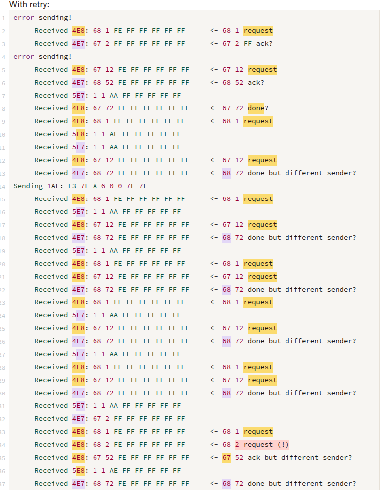

Text without highlights preserved below:
With retry:
```
error sending!
     Received 4E8: 68 1 FE FF FF FF FF FF      <- 68 1 request
     Received 4E7: 67 2 FF FF FF FF FF FF      <- 67 2 FF ack?
error sending!
     Received 4E8: 67 12 FE FF FF FF FF FF     <- 67 12 request
     Received 4E7: 68 52 FE FF FF FF FF FF     <- 68 52 ack?
     Received 5E7: 1 1 AA FF FF FF FF FF 
     Received 4E8: 67 72 FE FF FF FF FF FF     <- 67 72 done?
     Received 4E8: 68 1 FE FF FF FF FF FF      <- 68 1 request
     Received 5E8: 1 1 AE FF FF FF FF FF 
     Received 5E7: 1 1 AA FF FF FF FF FF 
     Received 4E8: 67 12 FE FF FF FF FF FF     <- 67 12 request
     Received 4E7: 68 72 FE FF FF FF FF FF     <- 68 72 done but different sender?
Sending 1AE: F3 7F A 6 0 0 7F 7F 
     Received 4E8: 68 1 FE FF FF FF FF FF      <- 68 1 request
     Received 5E7: 1 1 AA FF FF FF FF FF 
     Received 4E8: 67 12 FE FF FF FF FF FF     <- 67 12 request
     Received 4E7: 68 72 FE FF FF FF FF FF     <- 68 72 done but different sender?
     Received 5E7: 1 1 AA FF FF FF FF FF 
     Received 4E8: 68 1 FE FF FF FF FF FF      <- 68 1 request
     Received 4E8: 67 12 FE FF FF FF FF FF     <- 67 12 request
     Received 4E7: 68 72 FE FF FF FF FF FF     <- 68 72 done but different sender?
     Received 4E8: 68 1 FE FF FF FF FF FF      <- 68 1 request
     Received 5E7: 1 1 AA FF FF FF FF FF 
     Received 4E8: 67 12 FE FF FF FF FF FF     <- 67 12 request
     Received 4E7: 68 72 FE FF FF FF FF FF     <- 68 72 done but different sender?
     Received 5E7: 1 1 AA FF FF FF FF FF 
     Received 4E8: 68 1 FE FF FF FF FF FF      <- 68 1 request
     Received 4E8: 67 12 FE FF FF FF FF FF     <- 67 12 request
     Received 4E7: 68 72 FE FF FF FF FF FF     <- 68 72 done but different sender?
     Received 5E7: 1 1 AA FF FF FF FF FF 
     Received 4E7: 67 2 FF FF FF FF FF FF 
     Received 4E8: 68 1 FE FF FF FF FF FF      <- 68 1 request
     Received 4E8: 68 2 FE FF FF FF FF FF      <- 68 2 request (!)
     Received 4E8: 67 52 FE FF FF FF FF FF     <- 67 52 ack but different sender?
     Received 5E8: 1 1 AE FF FF FF FF FF 
     Received 4E7: 68 72 FE FF FF FF FF FF     <- 68 72 done but different sender?
```

Steady state seems to be this repeating:
```
     Received 4E8: 68 1 FE FF FF FF FF FF 
     Received 5E7: 1 1 AA FF FF FF FF FF 
     Received 4E8: 67 12 FE FF FF FF FF FF 
     Received 4E7: 68 72 FE FF FF FF FF FF 
```

## CANR0007.txt


This seems to be the common way 4E8 auths:
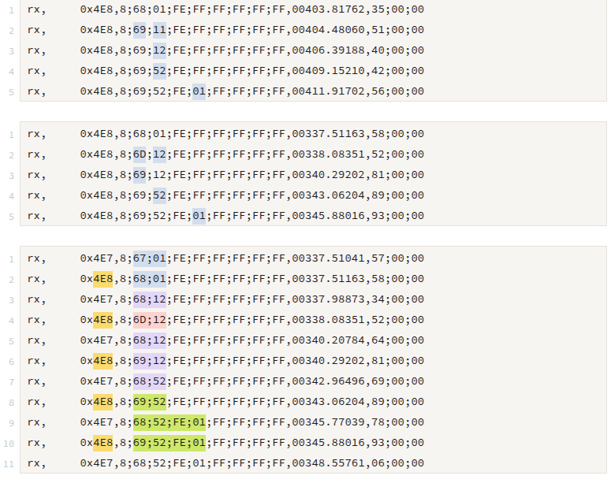
Text contents preserved below:

```
rx,     0x4E8,8;68;01;FE;FF;FF;FF;FF;FF,00403.81762,35;00;00
rx,     0x4E8,8;69;11;FE;FF;FF;FF;FF;FF,00404.48060,51;00;00
rx,     0x4E8,8;69;12;FE;FF;FF;FF;FF;FF,00406.39188,40;00;00
rx,     0x4E8,8;69;52;FE;FF;FF;FF;FF;FF,00409.15210,42;00;00
rx,     0x4E8,8;69;52;FE;01;FF;FF;FF;FF,00411.91702,56;00;00
```

```
rx,     0x4E8,8;68;01;FE;FF;FF;FF;FF;FF,00337.51163,58;00;00
rx,     0x4E8,8;6D;12;FE;FF;FF;FF;FF;FF,00338.08351,52;00;00
rx,     0x4E8,8;69;12;FE;FF;FF;FF;FF;FF,00340.29202,81;00;00
rx,     0x4E8,8;69;52;FE;FF;FF;FF;FF;FF,00343.06204,89;00;00
rx,     0x4E8,8;69;52;FE;01;FF;FF;FF;FF,00345.88016,93;00;00
```

```
rx,     0x4E7,8;67;01;FE;FF;FF;FF;FF;FF,00337.51041,57;00;00
rx,     0x4E8,8;68;01;FE;FF;FF;FF;FF;FF,00337.51163,58;00;00
rx,     0x4E7,8;68;12;FE;FF;FF;FF;FF;FF,00337.98873,34;00;00
rx,     0x4E8,8;6D;12;FE;FF;FF;FF;FF;FF,00338.08351,52;00;00
rx,     0x4E7,8;68;12;FE;FF;FF;FF;FF;FF,00340.20784,64;00;00
rx,     0x4E8,8;69;12;FE;FF;FF;FF;FF;FF,00340.29202,81;00;00
rx,     0x4E7,8;68;52;FE;FF;FF;FF;FF;FF,00342.96496,69;00;00
rx,     0x4E8,8;69;52;FE;FF;FF;FF;FF;FF,00343.06204,89;00;00
rx,     0x4E7,8;68;52;FE;01;FF;FF;FF;FF,00345.77039,78;00;00
rx,     0x4E8,8;69;52;FE;01;FF;FF;FF;FF,00345.88016,93;00;00
rx,     0x4E7,8;68;52;FE;01;FF;FF;FF;FF,00348.55761,06;00;00
```


CANopen, part2

Looks like this uses CANopen ids after all. Here’s an example handshake message:

```
480,8,00;01;FF;FF;FF;FF;FF;FF,00337.43695,14;00;00 -> 1001 0000000 -> 480 00 -> hello? ['00', '01', 'FF', 'FF', 'FF', 'FF', 'FF', 'FF']
```

Handshake seems to start by announcing yourself, with format

```
480 <id>: <id> 01 FF FF FF FF FF FF
```

Then the lowest id device (00 in `CANR0007.txt`) starts another round, but puts the next lowest ID it has seen in the first byte and `02` in the next:

```
480 00 -> hello? ['27', '02', 'FF', 'FF', 'FF', 'FF', 'FF', 'FF']
```

… at this time more announcement (`01`) messages can arrive. 
The node tagged in the message will in turn tag the next higher id it knows of with message type `12`, e.g.

```
480 27 -> hello? ['32', '12', 'FF', 'FF', 'FF', 'FF', 'FF', 'FF']
```

Maybe those are flags and `1*` means response whereas `0*` means new chain or so?
I also see `11` messages which seem to show up only when a node notices that it was skipped and can tag a next higher one. When a node was tagged with both `11` and `12` it seems that `12` takes precedence, e.g. here:

```
4EA,8,6D;11;FF;FF;FF;FF;FF;FF,00338.08969,53;00;00 -> 1001 1101010 -> 480 6A -> hello? ['6D', '11', 'FF', 'FF', 'FF', 'FF', 'FF', 'FF']
4E9,8,6A;11;FF;FF;FF;FF;FF;FF,00338.10470,57;00;00 -> 1001 1101001 -> 480 69 -> hello? ['6A', '11', 'FF', 'FF', 'FF', 'FF', 'FF', 'FF']
4EB,8,6D;11;FF;FF;FF;FF;FF;FF,00338.10713,58;00;00 -> 1001 1101011 -> 480 6B -> hello? ['6D', '11', 'FF', 'FF', 'FF', 'FF', 'FF', 'FF']
4ED,8,70;12;FE;FF;FF;FF;FF;FF,00338.17456,63;00;00 -> 1001 1101101 -> 480 6D -> hello? ['70', '12', 'FE', 'FF', 'FF', 'FF', 'FF', 'FF']
```

Some devices seem to start a new `02` chain without negative impact.

This repeats until there’s a tidy, uninterrupted chain where one node tags the next and `00` gets tagged with `12` again. Once that happens it kicks off a periodic `42` message that is responded to with `52`, even though again some devices start a new `42` chain.

That chain keeps going, apparently permanently. In practice there’s one new chain every 3 seconds or so. On my bench I need to keep the bus relatively busy or else risk the device sending message type `14` and losing haptic feedback on the iDrive.

It also seems that the 4th byte indicates ready or so, turning from `FF` to `01` over time. BZM (device 0x62) sets the 6th byte as `02` in addition to the `01` byte 4.

Some devices (4E7-4EA, notably including front and rear iDrive controller) have byte 3 `FE` instead of `FF` for all other devices.

# Appendix

Things that I found during research that didn’t end up being relevant...

## CAN message IDs

From [here](https://www.m5board.com/threads/any-interest-in-e60-can-bus-code-hacking.214354/page-2), note the `ErgoCommander` IDs `0x1AA` and `0x1B8`, which are the same as iDrive in the [Github spreadsheet](https://github.com/damienmaguire/BMW-E65-CANBUS/blob/master/E65_Codes.ods). My `0x4E8` ID isn’t listed, though.

```


CAN_ID_DEZ  CAN_ID_HEX  CAN_ID_NAME DIAG_ID_DEZ DIAG_ID_HEX SG_NAME
0   0x00    unbekannt   0   0x00    Sender unbekannt
168 0xA8    Drehmoment 1 K-CAN [10] 18  0x12    DME1/DDE1
169 0xA9    Drehmoment 2 (10)   18  0x12    DME1/DDE1
170 0xAA    Drehmoment 3 K-CAN [10] 18  0x12    DME1/DDE1
172 0xAC    Radmoment Antriebsstrang 2 [5]  18  0x12    DME1/DDE1
173 0xAD    Verzögerungsanforderung ACC [9] 28  0x1C    LDM
173 0xAD    Verzögerungsanforderung ACC [9] 33  0x21    ACC_Modul/ACC+NAVI
179 0xB3    Steuerung Lenkunterstützung [2] 22  0x16    AFS
180 0xB4    Radmoment Antriebsstrang 1 [4]  18  0x12    DME1/DDE1
181 0xB5    Drehmomentanforderung EGS [9]   24  0x18    EGS_MECH+NAVI/EGS_MECH
182 0xB6    Drehmomentanforderung DSC [7]   41  0x29    DXC_RB/DSC_RB/DSC_CT
183 0xB7    Drehmomentanforderung ACC [10]  28  0x1C    LDM
183 0xB7    Drehmomentanforderung ACC [10]  33  0x21    ACC_Modul/ACC+NAVI
184 0xB8    Drehmomentanforderung DKG [2]   24  0x18    DKG
185 0xB9    Drehmomentanforderung AFS [3]   22  0x16    AFS
186 0xBA    Getriebedaten [20]  24  0x18    SMG_M/SMG/EGS_MECH+NAVI/EGS_MECH/DKG
187 0xBB    Sollmomentanforderung [7]   41  0x29    DXC_RB
188 0xBC    Status Sollmomentumsetzung [7]  25  0x19    VGSG
189 0xBD    Drehmomentanforderung SSG [6]   24  0x18    SMG_M/SMG
190 0xBE    Alive Zähler [12]   35  0x23    ARS_Modul
191 0xBF    Anforderung Radmoment Antriebsstrang [6]    28  0x1C    LDM
192 0xC0    Alive Zentrales Gateway [1] 0   0x0 KGM
193 0xC1    Alive Zähler Telefon [3]    54  0x36    TEL_JAP/TEL_BPI
196 0xC4    Lenkradwinkel K-CAN [13]    41  0x29    DXC_RB/DSC_RB/DSC_CT
200 0xC8    Lenkradwinkel Oben K-CAN [6]    2   0x2 SZL_LWS
206 0xCE    Radgeschwindigkeit K-CAN [4]    41  0x29    DXC_RB/DSC_RB/DSC_CT
210 0xD2    Bedienung Sitzverstellung BF [6]    101 0x65    SZM_MIT_KBUS/SZM
213 0xD5    Anforderung Radmoment Bremse [6]    28  0x1C    LDM
215 0xD7    Alive Zähler Sicherheit [2] 1   0x1 ACSM
218 0xDA    Bedienung Sitzverstellung FA [6]    101 0x65    SZM_MIT_KBUS/SZM
225 0xE1    Radmoment Bremse [3]    41  0x29    DXC_RB/DSC_RB
226 0xE2    Status Zentralverriegelung BFT [11] 0   0x0 KGM
230 0xE6    Status Zentralverriegelung BFTH [11]    114 0x72    KBM
234 0xEA    Status Zentralverriegelung FAT [11] 0   0x0 KGM
238 0xEE    Status Zentralverriegelung FATH [11]    114 0x72    KBM
242 0xF2    Status Zentralverriegelung HK [13]  114 0x72    KBM
246 0xF6    Steuerung Außenspiegel [9]  0   0x0 KGM
250 0xFA    Steuerung Fensterheber FAT [10] 0   0x0 KGM
251 0xFB    Steuerung Fensterheber BFT [5]  0   0x0 KGM
252 0xFC    Steuerung Fensterheber FATH [5] 114 0x72    KBM
253 0xFD    Steuerung Fensterheber BFTH [5] 114 0x72    KBM
304 0x130   Klemmenstatus [19]  64  0x40    CAS
309 0x135   Steuerung Crashabschaltung EKP [1]  1   0x1 ACSM
351 0x15F   Anforderung Winkel FFP [6]  28  0x1C    LDM
370 0x172   Quittierung Anforderung Kombi [1]   98  0x62    M_ASK/CCC_GW
400 0x190   Anzeige ACC [13]    28  0x1C    LDM
400 0x190   Anzeige ACC [13]    33  0x21    ACC_Modul/ACC+NAVI
402 0x192   Bedienung Getriebewahlschalter [16] 2   0x2 SZL_LWS
403 0x193   Anzeige ACC DCC [4] 28  0x1C    LDM
404 0x194   Bedienung Tempomat/ACC [13] 2   0x2 SZL_LWS
408 0x198   Bedienung Getriebewahlschalter 2 [2]    94  0x5E    GWS
414 0x19E   Status DSC K-CAN [19]   41  0x29    DXC_RB/DSC_RB/DSC_CT
416 0x1A0   Geschwindigkeit K-CAN [14]  41  0x29    DXC_RB/DSC_RB/DSC_CT
418 0x1A2   Getriebedaten 2 [6] 24  0x18    EGS_MECH+NAVI/EGS_MECH/DKG
419 0x1A3   Rohdaten Längsbeschleunigung [3]    24  0x18    SMG_M
422 0x1A6   Wegstrecke [6]  41  0x29    DXC_RB/DSC_RB/DSC_CT
426 0x1AA   Effekt ErgoCommander [10]   98  0x62    M_ASK/CCC_GW
428 0x1AC   Status ARS-Modul [13]   35  0x23    ARS_Modul
436 0x1B4   Status Kombi [14]   96  0x60    Kombi
437 0x1B5   Wärmestrom/Lastmoment Klima [14]    120 0x78    IHKA
438 0x1B6   Wärmestrom Motor [11]   18  0x12    DME1/DDE1
440 0x1B8   Bedienung ErgoCommander [6] 103 0x67    ZBE_LO/ZBE
450 0x1C2   Abstandsmeldung PDC [5] 100 0x64    PDC
451 0x1C3   Abstandsmeldung 2 PDC [3]   100 0x64    PDC
454 0x1C6   Akustikmeldung PDC [5]  100 0x64    PDC
464 0x1D0   Motordaten [13] 18  0x12    DME1/DDE1
466 0x1D2   Anzeige Getriebedaten [22]  24  0x18    SMG_M/SMG/EGS_MECH+NAVI/EGS_MECH/DKG
470 0x1D6   Bedienung Taster Audio/Telefon [12] 2   0x2 SZL_LWS
472 0x1D8   Bedienung Klima Luftverteilung FA [13]  98  0x62    M_ASK/CCC_GW
473 0x1D9   Bedienung Taster M-Drive [2]    2   0x2 SZL_LWS
474 0x1DA   Bedienung Klima Fernwirken [5]  64  0x40    CAS
476 0x1DC   Bedienung Schichtung Sitzheizung [1]    98  0x62    M_ASK/CCC_GW
480 0x1E0   Bedienung Klima Luftverteilung BF [7]   98  0x62    M_ASK/CCC_GW
482 0x1E2   Bedienung Klima Front [11]  98  0x62    M_ASK/CCC_GW
487 0x1E7   Bedienung Sitzheizung/Sitzklima FA [7]  101 0x65    SZM_MIT_KBUS/SZM
488 0x1E8   Bedienung Sitzheizung/Sitzklima BF [7]  101 0x65    SZM_MIT_KBUS/SZM
490 0x1EA   Bedienung Lenksäulenverstellung [5] 2   0x2 SZL_LWS
491 0x1EB   Bedienung Aktivsitz FA [3]  101 0x65    SZM_MIT_KBUS/SZM
492 0x1EC   Bedienung Aktivsitz BF [3]  101 0x65    SZM_MIT_KBUS/SZM
493 0x1ED   Bedienung Lehnenbreitenverstellung Aktiv FA [2] 101 0x65    SZM_MIT_KBUS/SZM
494 0x1EE   Bedienung Lenkstockstaster [6]  2   0x2 SZL_LWS
495 0x1EF   Bedienung Lehnenbreitenverstellung Aktiv BF [2] 101 0x65    SZM_MIT_KBUS/SZM
498 0x1F2   Bedienung Sitzmemory BF [3] 101 0x65    SZM_MIT_KBUS/SZM
499 0x1F3   Bedienung Sitzmemory FA [4] 101 0x65    SZM_MIT_KBUS/SZM
500 0x1F4   Fernbedienung Sitzmemory BF [2] 255 0xFF    unbekannt
502 0x1F6   Blinken [6] 112 0x70    LM
508 0x1FC   Status AFS [4]  22  0x16    AFS
510 0x1FE   Crash [12]  1   0x1 ACSM
512 0x200   Regelgeschwindigkeit Stufentempomat [7] 18  0x12    DME1/DDE1
514 0x202   Dimmung [10]    112 0x70    LM
517 0x205   Akustikanforderung Kombi [3]    96  0x60    Kombi
518 0x206   Steuerung Anzeige Shiftlights [1]   18  0x12    DME1
523 0x20B   Memoryverstellung [6]   101 0x65    SZM_MIT_KBUS
523 0x20B   Memoryverstellung [6]   109 0x6D    SM_FA
524 0x20C   Steuerung Lenksäule (4) 109 0x6D    SM_FA
525 0x20D   Position Lenksäule (5)  101 0x65    SZM_MIT_KBUS/SZM
528 0x210   Bedienung HUD [7]   98  0x62    M_ASK/CCC_GW
529 0x211   Status HUD [7]  61  0x3D    HUD
530 0x212   Höhenstände Luftfeder [8]   56  0x38    EHC
538 0x21A   Lampenzustand [13]  112 0x70    LM
540 0x21C   Bedienung Night-Vision [2]  98  0x62    CCC_GW
542 0x21E   Status Night-Vision [2] 87  0x57    NVC
550 0x226   Regensensor-Wischergeschwindigkeit [8]  69  0x45    RLS
550 0x226   Regensensor-Wischergeschwindigkeit [8]  112 0x70    LM
552 0x228   Bedienung Sonderfunktion [8]    98  0x62    M_ASK/CCC_GW
552 0x228   Bedienung Sonderfunktion [8]    99  0x63    CCC_MM
554 0x22A   Status BFS [10] 110 0x6E    SM_BF
558 0x22E   Status BFSH [7] 255 0xFF    unbekannt
562 0x232   Status FAS [10] 109 0x6D    SM_FA
566 0x236   Status FASH [7] 255 0xFF    unbekannt
567 0x237   Status Lehnenbreitenverstellung Aktiv BF [3]    90  0x5A    aLBV_BF
569 0x239   Status Lehnenbreitenverstellung Aktiv FA [3]    89  0x59    aLBV_FA
570 0x23A   Status Funkschlüssel [13]   64  0x40    CAS
571 0x23B   Status Klima Front Erweitert [1]    120 0x78    IHKA
572 0x23C   Status Bedienung Sitzkomfort FA [1] 109 0x6D    SM_FA
575 0x23F   Status Bedienung Sitzkomfort BF [1] 110 0x6E    SM_BF
578 0x242   Status Klima Front [11] 120 0x78    IHKA
586 0x24A   Status PDC [6]  100 0x64    PDC
594 0x252   Wischerstatus [8]   114 0x72    KBM
598 0x256   Challenge Passive Access [10]   64  0x40    CAS
600 0x258   Status Transmission Passive Access [4]  39  0x27    PGS
604 0x25C   Bedienung Klima Zusatzprogramme [2] 98  0x62    M_ASK/CCC_GW
619 0x26B   Bedienung Rollos BF [2] 255 0xFF    unbekannt
620 0x26C   Bedienung Rollos FA [2] 0   0x0 KGM
621 0x26D   Bedienung Rollos MK [1] 255 0xFF    unbekannt
622 0x26E   Steuerung FH/SHD Zentrale (Komfort) [10]    64  0x40    CAS
623 0x26F   Bedienung Rollos BFH [2]    255 0xFF    unbekannt
624 0x270   Bedienung Rollos FAH [2]    255 0xFF    unbekannt
632 0x278   Navigationsgraph [3]    98  0x62    CCC_GW
634 0x27A   Synchronisation Navigationsgraph [4]    98  0x62    CCC_GW
638 0x27E   Status Verdeck Cabrio [7]   36  0x24    CVM_V
644 0x284   Steuerung Fernstart Sicherheitsfahrzeug [8] 64  0x40    CAS
645 0x285   Steuerung Rollos [3]    101 0x65    SZM_MIT_KBUS/SZM
652 0x28C   Bedienung Taster Vertikaldynamik [2]    94  0x5E    GWS
656 0x290   Steuerung Reaktion Wasserstoff-Fahrzeug [1] 255 0xFF    unbekannt
658 0x292   Steuerung Fernlicht-Assistent [2]   95  0x5F    FLA
671 0x29F   Fernbedienung FondCommander [5] 64  0x40    CAS
672 0x2A0   Steuerung Zentralverriegelung [10]  64  0x40    CAS
674 0x2A2   Bedienung Klima Standfunktionen [5] 98  0x62    M_ASK/CCC_GW
676 0x2A4   Bedienung Personalisierung [8]  98  0x62    M_ASK/CCC_GW
678 0x2A6   Bedienung Wischertaster [12]    2   0x2 SZL_LWS
690 0x2B2   Raddrücke K-CAN [1] 41  0x29    DXC_RB/DSC_RB/DSC_CT
691 0x2B3   Beschleunigungsdaten [2]    41  0x29    DXC_RB/DSC_RB/DSC_CT
692 0x2B4   DWA-Alarm [4]   65  0x41    DWA
694 0x2B6   Steuerung Hupe DWA [3]  65  0x41    DWA
696 0x2B8   Bedienung Bordcomputer [3]  98  0x62    M_ASK/CCC_GW
698 0x2BA   Stoppuhr (3)    96  0x60    Kombi
704 0x2C0   LCD-Leuchtdichte [7]    96  0x60    Kombi
714 0x2CA   Außentemperatur [9] 96  0x60    Kombi
718 0x2CE   Steuerung Monitor [4]   98  0x62    M_ASK/CCC_GW
725 0x2D5   Status Heizung Heckscheibe [1]  120 0x78    IHKA
730 0x2DA   Status Heckklappenlift [2]  107 0x6B    HKL
738 0x2E2   Status Einstellung Video Night-Vision [1]   87  0x57    NVC
740 0x2E4   Status Anhänger (8) 113 0x71    AHM
742 0x2E6   Status Klima Luftverteilung FA [13] 120 0x78    IHKA
746 0x2EA   Status Klima Luftverteilung BF [9]  120 0x78    IHKA
748 0x2EC   Status Klima SH/ZH Zusatzwasserpumpe [14]   122 0x7A    SH_ZH
750 0x2EE   Status Klima Zusatzprogramme [2]    120 0x78    IHKA
752 0x2F0   Status Klima Standfunktionen [12]   120 0x78    IHKA
756 0x2F4   Steuerung Klima SH/ZH Zusatzwasserpumpe [13]    120 0x78    IHKA
758 0x2F6   Steuerung Licht [7] 114 0x72    KBM
759 0x2F7   Einheiten [10]  98  0x62    M_ASK/CCC_GW
759 0x2F7   Einheiten [10]  99  0x63    CCC_MM
760 0x2F8   Uhrzeit/Datum [12]  96  0x60    Kombi
762 0x2FA   Sitzbelegung Gurtkontakte (14)  1   0x1 ACSM
764 0x2FC   ZV und Klappenzustand [11]  64  0x40    CAS
772 0x304   Status Gang [13]    24  0x18    SMG_M/SMG/EGS_MECH+NAVI/EGS_MECH/DKG
774 0x306   Fahrzeugneigung [2] 112 0x70    LM
776 0x308   Status MSA [2]  18  0x12    DME1/DDE1
784 0x310   Außentemperatur/Relativzeit [10]    96  0x60    Kombi
785 0x311   Nachtankmenge [3]   96  0x60    Kombi
786 0x312   Service Call Teleservice [2]    96  0x60    Kombi
787 0x313   Status Service Call Teleservice [3] 54  0x36    TEL_BPI
787 0x313   Status Service Call Teleservice [3] 98  0x62    M_ASK/CCC_GW
788 0x314   Status Fahrlicht [9]    69  0x45    RLS
788 0x314   Status Fahrlicht [9]    112 0x70    LM
789 0x315   Fahrzeugmodus [7]   101 0x65    SZM_MIT_KBUS/SZM
791 0x317   Bedienung Taster PDC [1]    101 0x65    SZM_MIT_KBUS/SZM
792 0x318   Status Antennen Passive Access [7]  39  0x27    PGS
793 0x319   Bedienung Taster RDC [4]    101 0x65    SZM
796 0x31C   Status Reifendruck [6]  32  0x20    RDC
797 0x31D   Status Reifenpannenanzeige [6]  41  0x29    DXC_RB/DSC_RB/DSC_CT
802 0x322   Dämpferstrom [2]    57  0x39    EDCK_Modul
806 0x326   Status Dämpferprogramm [9]  57  0x39    EDCK_Modul
808 0x328   Relativzeit [9] 96  0x60    Kombi
810 0x32A   Steuerung ALC [2]   112 0x70    LM
813 0x32D   Anzeige HDC [3] 41  0x29    DXC_RB
814 0x32E   Status Klima Interne Regelinfo [6]  120 0x78    IHKA
816 0x330   Kilometerstand/Reichweite [5]   96  0x60    Kombi
817 0x331   Programmierung Stufentempomat [2]   98  0x62    M_ASK/CCC_GW
818 0x332   Fahreranzeige Drehzahlbereich [4]   18  0x12    DME1/DDE1
821 0x335   Status Elektrische Kraftstoffpumpe [3]  23  0x17    EKP
822 0x336   Anzeige Checkcontrol-Meldung (Rolle) [3]    96  0x60    Kombi
823 0x337   Status Kraftstoffregelung DME [1]   18  0x12    DME1
824 0x338   Steuerung Anzeige Checkcontrol-Meldung [7]  96  0x60    Kombi
825 0x339   Status Anzeige Funktionen Extern [1]    98  0x62    M_ASK/CCC_GW
826 0x33A   Status Monitor Front [3]    115 0x73    CID_C_H/CID_C
840 0x348   Übereinstimmung Navigationsgraph [4]    98  0x62    CCC_GW
842 0x34A   Navigation GPS 1 [5]    98  0x62    CCC_GW
843 0x34B   Status Sitzlehnenverriegelung FA (3)    101 0x65    SZM_MIT_KBUS
843 0x34B   Status Sitzlehnenverriegelung FA (3)    109 0x6D    SM_FA
844 0x34C   Navigation GPS 2 [5]    98  0x62    CCC_GW
845 0x34D   Status Sitzlehnenverriegelung BF [2]    101 0x65    SZM_MIT_KBUS
845 0x34D   Status Sitzlehnenverriegelung BF [2]    110 0x6E    SM_BF
846 0x34E   Navigation System Information [6]   98  0x62    CCC_GW
858 0x35A   Termin Condition Based Service [2]  98  0x62    M_ASK/CCC_GW
860 0x35C   Status Bordcomputer [5] 96  0x60    Kombi
862 0x35E   Daten Bordcomputer (Reisedaten) [5] 96  0x60    Kombi
864 0x360   Daten Bordcomputer (Fahrtbeginn) [2]    96  0x60    Kombi
866 0x362   Daten Bordcomputer (Durchschnittswerte) [4] 96  0x60    Kombi
868 0x364   Daten Bordcomputer (Ankunft) [2]    96  0x60    Kombi
870 0x366   Anzeige Kombi/Externe Anzeige [3]   96  0x60    Kombi
871 0x367   Steuerung Anzeige Bedarfsorientierter Service [6]   96  0x60    Kombi
884 0x374   Radtoleranzabgleich [7] 41  0x29    DXC_RB/DSC_RB/DSC_CT
886 0x376   Status Verschleiß Lamelle [3]   25  0x19    VGSG
896 0x380   Fahrgestellnummer [5]   64  0x40    CAS
897 0x381   Elektronischer Motorölmessstab [10] 18  0x12    DME1/DDE1
898 0x382   Elektronischer Motorölmessstab M [1]    18  0x12    DME1/DDE1
904 0x388   Fahrzeugtyp [13]    64  0x40    CAS
910 0x38E   Startdrehzahl [1]   18  0x12    DME1/DDE1
916 0x394   RDA Anfrage/Datenablage [5] 96  0x60    Kombi
917 0x395   Codierung Powermanagement [2]   64  0x40    CAS
920 0x398   Bedienung Fahrwerk [14] 98  0x62    M_ASK/CCC_GW
921 0x399   Status M-Drive [2]  18  0x12    DME1
924 0x39C   EBA Datenanforderung [5]    255 0xFF    unbekannt
926 0x39E   Bedienung Uhrzeit/Datum [1] 98  0x62    M_ASK/CCC_GW
928 0x3A0   Fahrzeugzustand [4] 0   0x0 KGM
931 0x3A3   Anforderung Remote Services [2] 98  0x62    M_ASK/CCC_GW
940 0x3AC   Nachlaufzeit Klemme 30 fehlergesteuert [2]  0   0x0 KGM
944 0x3B0   Status Gang Rückwärts [2]   112 0x70    LM
945 0x3B1   Getriebedaten 3 [2] 24  0x18    EGS_MECH/DKG
947 0x3B3   Powermanagement Verbrauchersteuerung [8]    18  0x12    DME1/DDE1
948 0x3B4   Powermanagement Batteriespannung [11]   18  0x12    DME1/DDE1
949 0x3B5   Status Wasserventil [6] 120 0x78    IHKA
950 0x3B6   Position Fensterheber FAT [6]   0   0x0 KGM
951 0x3B7   Position Fensterheber FATH [5]  114 0x72    KBM
952 0x3B8   Position Fensterheber BFT [6]   0   0x0 KGM
953 0x3B9   Position Fensterheber BFTH [5]  114 0x72    KBM
954 0x3BA   Position SHD [10]   68  0x44    SHD/MDS
957 0x3BD   Status Verbraucherabschaltung [2]   114 0x72    KBM
958 0x3BE   Nachlaufzeit Stromversorgung [5]    64  0x40    CAS
959 0x3BF   Position Fensterheber Heckscheibe [1]   36  0x24    CVM_V
960 0x3C0   Konfiguration FAS [3]   109 0x6D    SM_FA
961 0x3C1   Konfiguration BFS [3]   110 0x6E    SM_BF
970 0x3CA   Konfiguration M-Drive [2]   98  0x62    M_ASK/CCC_GW
979 0x3D3   Status Solarsensor [1]  112 0x70    LM
980 0x3D4   Konfiguration Zentralverriegelung CKM [3]   98  0x62    M_ASK/CCC_GW
981 0x3D5   Status Zentralverriegelung CKM [4]  64  0x40    CAS
982 0x3D6   Konfiguration DWA CKM [1]   98  0x62    M_ASK/CCC_GW
983 0x3D7   Status DWA CKM [2]  65  0x41    DWA
984 0x3D8   Konfiguration RLS CKM [3]   98  0x62    M_ASK/CCC_GW
985 0x3D9   Status RLS CKM [4]  69  0x45    RLS
985 0x3D9   Status RLS CKM [4]  112 0x70    LM
986 0x3DA   Konfiguration Memorypositionen CKM [1]  98  0x62    M_ASK/CCC_GW
987 0x3DB   Status Memorypositionen CKM [3] 101 0x65    SZM_MIT_KBUS
987 0x3DB   Status Memorypositionen CKM [3] 109 0x6D    SM_FA
988 0x3DC   Konfiguration Licht CKM [3] 98  0x62    M_ASK/CCC_GW
989 0x3DD   Status Licht CKM [4]    112 0x70    LM
990 0x3DE   Konfiguration Klima CKM [5] 98  0x62    M_ASK/CCC_GW
991 0x3DF   Status Klima CKM [6]    120 0x78    IHKA
992 0x3E0   Konfiguration ALC CKM [1]   98  0x62    M_ASK/CCC_GW
993 0x3E1   Status ALC CKM [1]  112 0x70    LM
994 0x3E2   Konfiguration Heckklappe CKM [1]    98  0x62    M_ASK/CCC_GW
995 0x3E3   Status Heckklappe CKM [1]   107 0x6B    HKL
1001    0x3E9   Marker 1 [1]    255 0xFF    unbekannt
1002    0x3EA   Marker 2 [3]    126 0x7E    Diagnosetool_K_CAN_System
1003    0x3EB   Marker 3 [1]    125 0x7D    Diagnosetool_PT_CAN
1006    0x3EE   Anforderung Fehlermeldung [1]   255 0xFF    unbekannt
1007    0x3EF   OBD Daten Motor (3) 18  0x12    DME1/DDE1
1008    0x3F0   Konfiguration Licht Erweitert CKM [1]   98  0x62    M_ASK/CCC_GW
1009    0x3F1   Status Licht Erweitert CKM [1]  112 0x70    LM
1012    0x3F4   Konfiguration Laderaumabdeckung CKM [1] 98  0x62    M_ASK/CCC_GW
1013    0x3F5   Status Laderaumabdeckung CKM [1]    114 0x72    KBM
1022    0x3FE   Anforderung CAN_Testtool SI-Bus [5] 126 0x7E    Diagnosetool_K_CAN_System
1280    0x500   Datentransfer [1]   112 0x70    LM
1280    0x500   Datentransfer [1]   120 0x78    IHKA
1984    0x7C0   CAS Programmierung Bandende 1 (3)   64  0x40    CAS
1985    0x7C1   CAS Programmierung Bandende 2 (3)   255 0xFF    TOOL_BANDENDE_CAS
1986    0x7C2   CAS Applikationsnachricht 1 (3) 64  0x40    CAS
1987    0x7C3   CAS Applikationsnachricht 2 (3) 255 0xFF    TOOL_BANDENDE_CAS
1152    0x480   Netzwerkmanagement  0   0x0 KGM
1153    0x481   Netzwerkmanagement  1   0x1 ACSM
1154    0x482   Netzwerkmanagement  2   0x2 SZL_LWS
1170    0x492   Netzwerkmanagement  18  0x12    DDE1/DME1
1174    0x496   Netzwerkmanagement  22  0x16    AFS
1175    0x497   Netzwerkmanagement  23  0x17    EKP
1176    0x498   Netzwerkmanagement  24  0x18    DKG/EGS_MECH/EGS_MECH+NAVI/SMG/SMG_M
1177    0x499   Netzwerkmanagement  25  0x19    VGSG
1179    0x49B   Netzwerkmanagement  27  0x1B    VVT1
1180    0x49C   Netzwerkmanagement  28  0x1C    LDM
1182    0x49E   Netzwerkmanagement  30  0x1E    VVT2
1184    0x4A0   Netzwerkmanagement  32  0x20    RDC
1185    0x4A1   Netzwerkmanagement  33  0x21    ACC+NAVI/ACC_Modul
1187    0x4A3   Netzwerkmanagement  35  0x23    ARS_Modul
1188    0x4A4   Netzwerkmanagement  36  0x24    CVM_V
1189    0x4A5   Netzwerkmanagement  37  0x25    RSC_VDA/SC_CT/SC_VDA
1191    0x4A7   Netzwerkmanagement  39  0x27    PGS
1193    0x4A9   Netzwerkmanagement  41  0x29    DSC_CT/DSC_RB/DXC_RB
1206    0x4B6   Netzwerkmanagement  54  0x36    TEL_BPI/TEL_JAP/TEL_MULF
1207    0x4B7   Netzwerkmanagement  55  0x37    AMP_TOP
1208    0x4B8   Netzwerkmanagement  56  0x38    EHC
1209    0x4B9   Netzwerkmanagement  57  0x39    EDCK_Modul
1210    0x4BA   Netzwerkmanagement  58  0x3A    KHM
1211    0x4BB   Netzwerkmanagement  59  0x3B    JNAV
1212    0x4BC   Netzwerkmanagement  60  0x3C    CDC
1213    0x4BD   Netzwerkmanagement  61  0x3D    HUD
1216    0x4C0   Netzwerkmanagement  64  0x40    CAS
1217    0x4C1   Netzwerkmanagement  65  0x41    DWA
1220    0x4C4   Netzwerkmanagement  68  0x44    MDS/SHD
1221    0x4C5   Netzwerkmanagement  69  0x45    RLS/RLS
1227    0x4CB   Netzwerkmanagement  75  0x4B    VM
1232    0x4D0   Netzwerkmanagement  80  0x50    Notstrom-Sirene
1235    0x4D3   Netzwerkmanagement  83  0x53    IBOC
1236    0x4D4   Netzwerkmanagement  84  0x54    SDARS
1237    0x4D5   Netzwerkmanagement  85  0x55    ISpeechBox
1239    0x4D7   Netzwerkmanagement  87  0x57    NVC
1241    0x4D9   Netzwerkmanagement  89  0x59    aLBV_FA
1242    0x4DA   Netzwerkmanagement  90  0x5A    aLBV_BF
1243    0x4DB   Netzwerkmanagement  91  0x5B    DAB
1244    0x4DC   Netzwerkmanagement  92  0x5C    Behoerde
1245    0x4DD   Netzwerkmanagement  93  0x5D    TLC
1246    0x4DE   Netzwerkmanagement  94  0x5E    GWS
1247    0x4DF   Netzwerkmanagement  95  0x5F    FLA
1248    0x4E0   Netzwerkmanagement  96  0x60    Kombi
1250    0x4E2   Netzwerkmanagement  98  0x62    CCC_GW/M_ASK
1251    0x4E3   Netzwerkmanagement  99  0x63    CCC_MM
1252    0x4E4   Netzwerkmanagement  100 0x64    PDC
1253    0x4E5   Netzwerkmanagement  101 0x65    SZM/SZM_MIT_KBUS
1255    0x4E7   Netzwerkmanagement  103 0x67    ZBE/ZBE_LO
1259    0x4EB   Netzwerkmanagement  107 0x6B    HKL
1261    0x4ED   Netzwerkmanagement  109 0x6D    SM_FA/SM_FA_KBUS
1262    0x4EE   Netzwerkmanagement  110 0x6E    SM_BF/SM_BF_KBUS
1264    0x4F0   Netzwerkmanagement  112 0x70    LM/LM_ALC
1265    0x4F1   Netzwerkmanagement  113 0x71    AHM
1266    0x4F2   Netzwerkmanagement  114 0x72    KBM
1267    0x4F3   Netzwerkmanagement  115 0x73    CID_C/CID_C_H
1272    0x4F8   Netzwerkmanagement  120 0x78    IHKA
1274    0x4FA   Netzwerkmanagement  122 0x7A    SH_ZH
1277    0x4FD   Netzwerkmanagement  125 0x7D    Diagnosetool_PT_CAN
1278    0x4FE   Netzwerkmanagement  126 0x7E    Diagnosetool_K_CAN_System
1289    0x509   Netzwerkmanagement  137 0x89    Xenon_Scheinwerfer_Links_ALC
1290    0x50A   Netzwerkmanagement  138 0x8A    Xenon_Scheinwerfer_Rechts_ALC
1291    0x50B   Netzwerkmanagement  139 0x8B    CNV
1393    0x571   Netzwerkmanagement  241 0xF1    Diagnosedose
1408    0x580   Dienste 0   0x0 KGM
1409    0x581   Dienste 1   0x1 ACSM
1410    0x582   Dienste 2   0x2 SZL_LWS
1426    0x592   Dienste 18  0x12    DDE1/DME1
1430    0x596   Dienste 22  0x16    AFS
1431    0x597   Dienste 23  0x17    EKP
1432    0x598   Dienste 24  0x18    DKG/EGS_MECH/EGS_MECH+NAVI/SMG/SMG_M
1433    0x599   Dienste 25  0x19    VGSG
1435    0x59B   Dienste 27  0x1B    VVT1
1436    0x59C   Dienste 28  0x1C    LDM
1438    0x59E   Dienste 30  0x1E    VVT2
1440    0x5A0   Dienste 32  0x20    RDC
1441    0x5A1   Dienste 33  0x21    ACC+NAVI/ACC_Modul
1443    0x5A3   Dienste 35  0x23    ARS_Modul
1444    0x5A4   Dienste 36  0x24    CVM_V
1445    0x5A5   Dienste 37  0x25    RSC_VDA/SC_CT/SC_VDA
1447    0x5A7   Dienste 39  0x27    PGS
1449    0x5A9   Dienste 41  0x29    DSC_CT/DSC_RB/DXC_RB
1462    0x5B6   Dienste 54  0x36    TEL_BPI/TEL_JAP/TEL_MULF
1463    0x5B7   Dienste 55  0x37    AMP_TOP
1464    0x5B8   Dienste 56  0x38    EHC
1465    0x5B9   Dienste 57  0x39    EDCK_Modul
1466    0x5BA   Dienste 58  0x3A    KHM
1467    0x5BB   Dienste 59  0x3B    JNAV
1468    0x5BC   Dienste 60  0x3C    CDC
1469    0x5BD   Dienste 61  0x3D    HUD
1472    0x5C0   Dienste 64  0x40    CAS
1473    0x5C1   Dienste 65  0x41    DWA
1476    0x5C4   Dienste 68  0x44    MDS/SHD
1477    0x5C5   Dienste 69  0x45    RLS/RLS
1483    0x5CB   Dienste 75  0x4B    VM
1488    0x5D0   Dienste 80  0x50    Notstrom-Sirene
1491    0x5D3   Dienste 83  0x53    IBOC
1492    0x5D4   Dienste 84  0x54    SDARS
1493    0x5D5   Dienste 85  0x55    ISpeechBox
1495    0x5D7   Dienste 87  0x57    NVC
1497    0x5D9   Dienste 89  0x59    aLBV_FA
1498    0x5DA   Dienste 90  0x5A    aLBV_BF
1499    0x5DB   Dienste 91  0x5B    DAB
1500    0x5DC   Dienste 92  0x5C    Behoerde
1501    0x5DD   Dienste 93  0x5D    TLC
1502    0x5DE   Dienste 94  0x5E    GWS
1503    0x5DF   Dienste 95  0x5F    FLA
1504    0x5E0   Dienste 96  0x60    Kombi
1506    0x5E2   Dienste 98  0x62    CCC_GW/M_ASK
1507    0x5E3   Dienste 99  0x63    CCC_MM
1508    0x5E4   Dienste 100 0x64    PDC
1509    0x5E5   Dienste 101 0x65    SZM/SZM_MIT_KBUS
1511    0x5E7   Dienste 103 0x67    ZBE/ZBE_LO
1515    0x5EB   Dienste 107 0x6B    HKL
1517    0x5ED   Dienste 109 0x6D    SM_FA/SM_FA_KBUS
1518    0x5EE   Dienste 110 0x6E    SM_BF/SM_BF_KBUS
1520    0x5F0   Dienste 112 0x70    LM/LM_ALC
1521    0x5F1   Dienste 113 0x71    AHM
1522    0x5F2   Dienste 114 0x72    KBM
1523    0x5F3   Dienste 115 0x73    CID_C/CID_C_H
1528    0x5F8   Dienste 120 0x78    IHKA
1530    0x5FA   Dienste 122 0x7A    SH_ZH
1533    0x5FD   Dienste 125 0x7D    Diagnosetool_PT_CAN
1534    0x5FE   Dienste 126 0x7E    Diagnosetool_K_CAN_System
1545    0x609   Dienste 137 0x89    Xenon_Scheinwerfer_Links_ALC
1546    0x60A   Dienste 138 0x8A    Xenon_Scheinwerfer_Rechts_ALC
1547    0x60B   Dienste 139 0x8B    CNV
1649    0x671   Dienste 241 0xF1    Diagnosedose
4095    0xFFF   unbekannt   255 0xFF    Sender unbekannt
```

## K-CAN messages from [Loopbunny](http://www.loopybunny.co.uk/CarPC/k_can.html)


| Can-ID | Length | DATA Packet HEX         | DATA Packet DECIMAL             | Register Description                        | Reg | Mini | Kcan1 | KCan2 | Source |
| ------ | ------ | ----------------------- | ------------------------------- | ------------------------------------------- | --- | ---- | ----- | ----- | ------ |
| 0A5    | 8      | CD D5 EC C7 7E 34 0C F1 | 205 213 236 199 126 052 012 241 | Throttle and RPM                            |     |      | N     | Y     |        |
| 0A8    | 8      | 54 D7 2B D0 2B F0 0F 02 | 084 215 043 208 043 240 015 002 | Torque, Clutch and Brake status             |     |      | Y     | N     |        |
| 0AA    | 8      | 5F 59 FF 00 34 0D 80 99 | 095 089 255 000 052 013 128 153 | Engine RPM and throttle position            |     |      | Y     | N     |        |
| 0C0    | 2      | F4 FF                   | 244 255                         | ABS / Brake counter                         |     |      | Y     | N     | JBE    |
| 0C4    | 7      | 83 FD FC 00 00 FF F1    | 131 253 252 000 000 255 241     | Steering Wheel position (See 0C8)           |     |      | Y     | N     |        |
| 0C8    | 6      | DD 07 FC 00 00 FF       | 221 007 252 000 000 255         | Steering Wheel position (Sent 2x often 0C4) |     |      | Y     | N     | SZL    |
| 0CE    | 8      | DA 02 DC 02 DC 02 D9 02 | 218 002 220 002 220 002 217 002 | Individual Wheel Speeds (4x Pairs)          |     |      | Y     | N     |        |
| 0D7    | 2      | C3 FF                   | 195 255                         | Counter (Airbag / Seatbelt Related)         |     |      | Y     | N     |        |
| 0E2    | 8      | 81 FF E7 FC FF FF FF FF | 129 255 231 252 255 255 255 255 | Passenger door status Unlocked, Open        |     |      | Y     | Y     | JBE    |
| 0E6    | 8      | 81 FF E7 FC FF FF FF FF | 129 255 231 252 255 255 255 255 | Rear Passenger door status Unlocked, Open   |     |      | Y     | Y     | JBE    |
| 0EA    | 8      | 81 FF E7 FC FF FF FF FF | 129 255 231 252 255 255 255 255 | Driver door status Unlocked, Open           |     |      | Y     | Y     | JBE    |
| 0EE    | 8      | 81 FF E7 FC FF FF FF FF | 129 255 231 252 255 255 255 255 | Rear Driver door status Unlocked, Open      |     |      | Y     | Y     |        |
| 0F2    | 8      | F1 FF 87 C0 FF FF FF FF | 241 255 135 192 255 255 255 255 | Boot status Unlocked, release button, Open  |     |      | Y     | Y     |        |
| 0FA    | 3      | C0 00 FF                | 192 000 255                     | Electric Window controls (Driver controls)  |     |      | Y     |       |        |
| 0FB    | 3      | C7 FF FF                | 199 255 255                     | Electric Window controls (Front Passenger)  | W   |      | Y     |       |        |
| 130    | 5      | 45 40 21 8F FE          | 069 064 033 143 254             | Ignition and Key status (Term 15 / R ON?)   |     |      | Y     | Y     | CAS    |
| 193    | 8      | 27 FE F1 00 F8 50 00 00 | 039 254 241 000 248 080 000 000 | Timer & Cruise control status               |     |      | Y     |       |        |
| 19E    | 8      | 00 E0 B3 FC F0 43 00 65 | 000 224 179 252 240 067 000 101 | ABS / Braking force                         |     |      | Y     | N     | DSC    |
| 1A1    | 5      | BE DE 12 04 91          | 190 222 018 004 145             | Speed                                       |     |      | N     | Y     |        |
| 1A6    | 8      | 13 4D 46 4D 33 4D D0 FF | 019 077 070 077 051 077 208 255 | Speed, as used by the instrument cluster    |     |      | Y     | Y     |        |
| 1B4    | 8      | 00 D0 E0 F8 00 32 FE 91 | 000 208 224 248 000 050 254 145 | Speed [MPH] Handbrake status                |     |      | Y     | N     | Kombi  |
| 1C2    | 8      | 8D 72 5B 5A FF FF FF FF | 141 114 091 090 255 255 255 255 | PDC (Reverse) / (Front) Sensor data         |     |      | Y     |       |        |
| 1D0    | 8      | 4C FF 63 CD 5D 37 CD A8 | 076 255 099 208 093 055 205 168 | Engine temp, Pressure sensor & Handbrake    |     |      | Y     | N     |        |
| 1D6    | 2      | C0 0C                   | 192 012                         | MFL (Steering Wheel) Buttons                |     |      | Y     | Y     | SZL    |
| 1E1    | 6      | D4 F1 00 FF FF FF       | 212 241 000 255 255 255         | Counter and Door Status (200mS intervals)   |     |      | Y     | Y     |        |
| 1E3    | 2      | F1 FF                   | 141 255                         | Interior Light Switch                       | W   |      | Y     |       |        |
| 1EE    | 2      | 00 FF                   | 000 255                         | Indicator Stalk position                    |     |      | Y     | Y     |        |
| 1F6    | 2      | 80 F0                   | 128 240                         | Indicator Status                            | W*  |      | Y     | Y     |        |
| 202    | 2      | 54 FF                   | 084 255                         | Lights (Dimmer Status)                      |     |      | Y     | Y     | Kombi  |
| 21A    | 3      | 05 12 F7                | 005 018 247                     | Lighting Status                             |     |      | Y     | Y     |        |
| 23A    | 4      | 00 30 00 60             | 000 048 000 096                 | Remote Control Keyfob Actions               |     |      | Y     | Y     |        |
| 246    | 5      | 3F F3 00 FC FF          | 063 243 000 252 255             | Air Con, Demister Status                    |     |      | Y     | Y     |        |
| 24A    | 2      | 06 FF                   | 006 255                         | Reverse Status                              |     |      | Y     |       |        |
| 24B    | 2      | 00 F8                   | 000 248                         | Door status, similar to 2FC                 |     |      | Y     | Y     |        |
| 252    | 2      | CE FF                   | 206 255                         | Windscreen Wiper Status                     |     |      | Y     |       | JBE    |
| 264    | 6      | E1 FD 21 A2 7F 1E       | 225 253 033 162 127 030         | iDrive Controller (Rotary Control)          |     |      | Y     |       | CON    |
| 267    | 6      | E1 FD CC 01 DE 01       | 225 253 204 001 222 001         | iDrive Controller (Direction / Buttons)     |     |      | Y     | Y     | CON    |
| 26E    | 8      | 00 40 7F 50 FF FF FF FF | 000 064 127 080 255 255 255 255 | Ignition Status                             |     |      | Y     | Y     | CAS    |
| 273    | 8      | 1D E1 00 F0 FF 7F DE 04 | 029 225 000 240 255 127 222 004 | CCC / CIC Status                            |     |      | Y     | N     | CIC    |
| 277    | 8      | E1 9D 04 FF             | 225 157 004 255                 | iDrive controller reply to 0x273            |     |      | Y     | N     | CON    |
| 286    | 2      | 00 FF                   | 000 255                         | Rear View Mirror, Light sensor              |     |      | Y     | Y     |        |
| 2A6    | 2      | 00 F9                   | 000 249                         | Windscreen Wiper Controls                   |     |      | Y     | Y     | SZL    |
| 2B4    | 2      | 00 F2                   | 000 242                         | Door locking (Via Remote Control)           |     |      | Y     |       |        |
| 2B8    | 6      | 31 00 F0 00 00 E3       | 049 000 240 000 000 227         | Reset Av Fuel / Speed                       |     |      | Y     |       | Radio  |
| 2BA    | 5      | 00 00 00 00 10          | 000 000 000 000 16              | Counter (Toggle / Heartbeat)                |     |      | Y     | N     | Kombi  |
| 2CA    | 2      | 61 FF                   | 097 255                         | Outside temperature                         |     |      | Y     | TBC   | Kombi  |
| 2D6    | 3      | FF FC FF                | 255 252 255                     | Air Conditioning Status                     |     |      | Y     | Y     |        |
| 2E6    | 8      | 64 00 00 FF 00 01 3F 34 | 100 000 000 255 000 001 063 052 | Climate control status (Fan and Temp speed) |     |      | Y     | Y     |        |
| 2EA    | 8      | FF FF FF FF FF FF FF 34 | 255 255 255 255 255 255 255 52  | Climate control status (Passenger)          |     |      | Y     | Y     |        |
| 2F8    | 8      | 13 2E 1E 01 4F DC 07 FD | 019 046 030 001 079 220 007 253 | Report Time and Date                        |     |      | Y     | Y     | Kombi  |
| 2FC    | 7      | 81 01 00 FF FF FF FF    | 129 001 000 255 255 255 255     | Door Status                                 |     |      | Y     | Y     | CAS    |
| 328    | 6      | 16 83 A2 04 DE 11       | 022 126 244 003 222 017         | 1 Second count from battery removal / reset |     |      | Y     | Y     | Kombi  |
| 32E    | 8      | 00 FF 8F 63 6A 00 2E 0F | 00 255 143 099 106 000 046 015  | Internal Temp, Light and solar sensors      |     |      | Y     | Y     |        |
| 330    | 8      | 7A 5A 00 2D 29 2F 9C 34 | 122 090 000 045 041 047 156 052 | Odometer, Av Fuel, and Range                |     |      | Y     | Y     | Kombi  |
| 338    | 8      | 8D 01 20 F0 00 FE FE FE | 141 001 032 240 000 254 254 254 | CC-ID Error Code                            |     |      | Y     |       |        |
| 349    | 5      | 76 0F BE 1A 00          | 118 015 190 026 000             | Fuel Level sensors                          |     |      | Y     | Y     | JBE    |
| 34A    | 5      | 6F 15 13 FF 03 BE B5 24 | 111 021 019 255 003 190 181 036 | GPS Position                                |     |      | Y     | Y     | CCC    |
| 34F    | 2      | FE FF                   | 254 255                         | Handbrake status                            |     |      | Y     |       |        |
| 362    | 7      | AE F3 1E FF FF FF EA    | 174 241 030 255 255 255 234     | Average MPH & Average MPG                   |     |      | Y     | N     | Kombi  |
| 366    | 4      | 78 50 14 FC             | 120 080 020 252                 | Ext Temp & Range                            |     |      | Y     | N     | Kombi  |
| 380    | 7      | 56 xx 35 32 38 37 xx    | 086 xxx 053 050 056 055 xxx     | VIN Number                                  |     |      | Y     |       | CAS    |
| 394    | 8      | 48 0F 10 6B 00 88 58 01 | 072 015 016 107 000 136 088 001 | Hours / Distance since last service.        |     |      | Y     |       |        |
| 39E    | 8      | 0B 10 00 0D 1F DF 07 F2 | 011 016 000 013 031 223 007 242 | Set Time and Date                           |     |      | Y     |       |        |
| 3B0    | 2      | FD FF                   | 253 255                         | Reverse Status                              |     |      | Y     |       |        |
| 3B4    | 8      | A6 F3 00 FC FF FF FF FF | 165 243 000 252 255 255 255 255 | Battery Voltage & Charge status             |     |      | Y     | N     |        |
| 3B6    | 3      | 00 FC F0                | 000 252 240                     | Passenger Front Window status               |     |      | Y     | N     |        |
| 3B7    | 3      | 41 F5 F8                | 065 245 248                     | Driver Rear Window status                   |     |      | Y     | Y     | JBE    |
| 3B8    | 3      | 00 FC F0                | 000 252 240                     | Driver Front Window status                  |     |      | Y     |       |        |
| 3B9    | 3      | 41 F5 F8                | 065 245 248                     | Passenger Rear Window status                |     |      | Y     |       | JBE    |
| 581    | 8      | 40 4D 00 28 FF FF FF FF | 064 077 000 040 255 255 255 255 | Seatbelt Status                             |     |      | Y     |       |        |
| 7C3    | 8      | xx xx xx xx xx xx xx xx | xxx xxx xxx xxx xxx xxx xxx xxx | Keyfob (security, comfort and CBS data)     |     |      | Y     |       | CAS    |


## PR-1000 Documentation

Note: the [PR-1000](http://lirc.10951.n7.nabble.com/Immersion-PR-1000-Haptic-Rotary-Encoder-td6249.html), see also [here](https://web.archive.org/web/20080703131808/https://www.immersion.com/industrial/rotary/products/PR1000.php), and [datasheet](https://web.archive.org/web/20071019061227/http://www.immersion.com/industrial/docs/pr1000_rotary_module_jan07v4lr.pdf), is smaller, draws less power.

> DC supply voltage: 5V, Max. system current: 450 mA, Standby current: 55 mA. 5V TTL UART

The official PR-1000 developer kit documentation is preserved [here](https://web.archive.org/web/20160805142148/https://ofb.net/~egnor/ImmPR1DevKitHaptics.pdf), with this [thread](http://lirc.10951.n7.nabble.com/Immersion-PR-1000-Haptic-Rotary-Encoder-td6249.html) pointing to “unofficial protocol details” [here](https://web.archive.org/web/20160805142148/https://ofb.net/~egnor/pr1000.html).

[Apparently](https://web.archive.org/web/20160805142148/https://ofb.net/~egnor/pr1000.html) there was a successor made, the [IntuiTek PR-1.5](https://www.yumpu.com/en/document/view/37327430/pr-15-rotary-haptic-control-data-sheet-methode-electronics-inc).


## PR-1000 Unofficial Protocol Details

The PR-1000 is a programmable rotary encoder with haptic feedback. What this means is that, in theory, it's the world's most awesome knob control. It can be instantly switched in software to be a free-spinning knob, a knob with "detents" (like a car's volume control), a knob with snappier fixed positions (like an old-style TV channel changer), variable resistance to motion, "set points" that it falls into (like the center point of a balance knob), and so on.

As of this writing (June 2008), you can get one for $119.99 from [mp3Car.com](https://web.archive.org/web/20160805142148/http://store.mp3car.com/Immersion_TouchSense_PR_1000_USB_p/com-045.htm). It comes with a little USB interface board, the encoder itself, and a plastic knob that goes on the shaft (which you can replace with something sexier, if you like).

The catch is that, for some dumb reason, Immersion aren't publishing the protocol for interacting with their hardware. You can buy an SDK from them for thousands of dollars. That seems counterproductive to me, but maybe they're being distracted by a business model that has more to do with licensing IP than with selling hardware.

Anyway, the mp3Car guys have a Windows DLL that you can use to put it in one or two pre-programmed modes. That won't do! So, with a bunch of fooling around, I have reverse engineered the protocol used to talk to the knob.

Physical Interface
The encoder itself has a little 4-pin connector. Looking at the connector with the key facing away, these are the pin assignments, from left to right:

1. Receive Data (into encoder)
2. Transmit Data (into encoder)
3. +5V (draws about 70mA when idle)
4. Ground

The data lines use the RS-232 protocol but with 5V (TTL) logic levels. (Thanks to Cobey Smith for this info!)

If you're using the mp3Car kit, you don't need to worry about this; the mp3Car adapter board has a little FTDI USB/serial adapter chip, line level shifters and so on. For some reason this board is not a standard USB serial device, but you can get drivers:

- For Windows, you can use [mp3Car's official driver](https://web.archive.org/web/20160805142148/http://store.mp3car.com/ProductDetails.asp?ProductCode=COM%2D045&Show=ExtInfo). It's apparently the same driver they use for some sort of XM radio interface, but don't worry about the name, it works fine, and the device shows up as COM5: or whatever.
- For Mac, there are [FTDI drivers](https://web.archive.org/web/20160805142148/http://www.ftdichip.com/Drivers/VCP.htm) you could probably adapt. You'll have to set the Vendor ID (0x6846) and Product ID (0x0001) somehow. You're on your own here.
- I use Linux, which (as of 2.6) already includes a driver for the chip, but needs to be configured with the Vendor ID (0x6486) and Product ID (0x0001). Here's what I did (for Ubuntu Gutsy):
    echo options ftdi_sio vendor=0x6846 product=0x0001 > /etc/modprobe.d/pr1000
    echo ftdi_sio >> /etc/modules
    modprobe ftdi_sio
- Once that's done, the device shows up as /dev/ttyUSB0. (If you have other USB serial devices, it might be assigned a different name. Check your dmesg logs, I guess.)

Anyway, after this is done, the knob should be on and you have a serial port device for talking to it. The knob uses 19200 baud, N/8/1, no flow control. You can use your favorite language and serial port library, I like Python and [pySerial](https://web.archive.org/web/20160805142148/http://pyserial.sourceforge.net/).
Since there's no flow control, make sure not to send too much data all at once, it might overwhelm the device.

### Serial Interface
The actual wire-level serial interface is really simple. The device has 60 byte-sized registers. Some of them are read-only, most are read-write. (Actually some of the registers are word-sized, but the high and low bytes are individually addressed.) Everything you do with the device is done by reading or writing these registers. Some of the registers reflect the current position of the knob, and when the user frobs it, you get updates.
Here's the message format used for both directions (host->device and device->host):

- Start byte: this is always hex 0x5A (90 decimal).
- First register to read or write (one byte), plus hex 0x80 for writes.
- Number of registers to read or write (one byte), plus start/stop bits:
    - Add hex 0x80 for the first write in an update sequence.
    - Add hex 0x40 for the last (or only) write in an update sequence.
- Register data (one byte each; not present for read requests).
- A checksum byte (XOR of the other bytes, including the start byte).

For example, to get all 60 device registers, you would send 5A 00 3C 66. The device would respond with 5A 00 3C .... XX, where .... is a dump of all 60 register bytes, and XX is the appropriate checksum. If you wanted to set registers 13 and 14 to 1 and 2 you would send 5A 8D 82 01 02 56.

When the user wiggles the knob, the device sends 5A 86 05 ?? ?? ?? ?? ?? XX. This is giving you an update on registers 6-11 (the ?? values), which are the registers that change when the knob is moved, followed by the appropriate checksum (XX).

Start/stop bits in the length byte are used during writes to update many registers atomically. When a write is received with 0x80 set in the length byte, writes are buffered until a write is received with 0x40 set in the length byte, at which point all buffered writes take effect. To ensure a write is processed immediately, always add 0x40 to the length byte. (Thanks to Cobey Smith and Reed Martin for help figuring these out.)

Simple enough, right? The trick is knowing what all the registers do. Read on...

### Device Overview
The PR-1000 is a rotary encoder coupled with an electromagnetic brake and a little microcontroller. The rotary encoder reports the precise position of the shaft at all times. The electromagnetic brake can be configured to provide varying amounts of "drag", which makes it easier or harder to turn the shaft. There's a limit to the amount of braking, which means that there's no such thing as a total hard stop on shaft rotation. If you configure it for a hard stop, you can always push past it with a little bit of force. (Don't worry, this doesn't hurt anything.) This also means that the device can only resist motion, it can't actually rotate the shaft under its own power, for example it can't "spring back" into a set position when the user lets go.

What you're defining is a resistance profile which tells the device how much resistance to apply for which position of the knob. The microcontroller adjusts the brake as the user turns the knob to give the illusion of going over hills and valleys. One slightly fancy bit is that the resistance profile can be longer than one full turn of the knob, meaning it takes several turns to wind your way through it. (Think about a tuner control, where you rotate the knob many times to work your way from one end of the dial to another, but there are hard stops at the ends and perhaps notches along the way for stations.)

You don't get to define a totally arbitrary resistance profile. The profile has a beginning, and an ending, and in between a specific number of sections (the term is mine, probably Immersion calls them something else). You get to define two types of sections, default sections and alternate sections. Every section of each type is identical, so you have a series of identical bumps or notches or whatever. Normally all sections are default sections, but you can specify that a certain subrange of sections are alternate sections, or that every Nth section is an alternate section. So, for a balance control, you could have 11 notches, but make the center one deeper or wider or whatever.
For each type of section, you can choose the basic shape, which can either be flat (constant resistance), one of two stock shapes (a hill and a notch), or a custom shape defined by a series of control points. You can also set the width and maximum resistance and various other attributes separately for each section type.

For the endpoints, you can either make them hard stops (again, there's no true hard stop, the user can push through with some force), or a gentle hill, or no barrier at all (the wheel just keeps spinning).

Okay, now you've got the basic idea, let's see the actual settings.

### Registers
Unless specified, read/write registers default to 0.
Registers 0-3: fixed mystery values, read-only
These registers are always fixed on my device, to 0x01, 0x07, 0x03, and 0x40 respectively. I'm guessing they're some sort of version or capability code.

Registers 4,5: encoder resolution (lo, hi byte), read-only
This two byte value gives the resolution of the encoder, in counts per revolution. On my device this is 0x880 (2176) and apparently can't be changed. That means the smallest movement it can detect is 0.17 degrees, which isn't bad.

Register 6: push button, read-only
This is 0 normally, 1 when the knob is pressed in. You will automatically get an update when the knob is pushed or released.

Register 7: configuration version, read-only
This value starts at 0 and increments by one any time you program one of the registers. You will automatically get an update when you set a register. You can use this value to know that the device has processed your update.

Register 8: current section, read-write
Which section the knob is currently positioned within. This can be from 1 to the number of sections defined (see register 11), -1 (0xFF) if the knob is before the first section, or -2 (0xFE) if the knob is after the last section. You will automatically get an update when the knob moves. You can set this value; the knob doesn't physically rotate, but it acts as if it had.

Registers 9,10: position within section (lo, hi byte), read-write
The exact position within this section, in encoder counts (see registers 4,5). The range of values depends on the width of the section (see registers 16,17 and 30,31), but is negative on the left side, 0 in the center of the section, and positive on the right side. You will automatically get an update when the knob moves. You can set this value; the knob doesn't physically rotate, but it acts as if it had.

Register 11: number of sections, read-write, default 255 (0xFF)
The number of sections (both default and alternate) from the beginning to the end. Note that there are two "half sections" added before and after the defined number of sections, which seem to be put there by Immersion to merge better with the end points, and also to make things confusing. So really you will end up with N+1 sections.

Register 12: endpoint stops, read-write, default 17 (0x11)
The high nybble controls the left endpoint, the low nybble controls the right endpoint. Each nybble can be one of these values:

- 1 - no barrier at all (knob freely spins past the endpoint)
- 2 - hard stop (knob stops suddenly at endpoint)
- 3 - gentle hill (knob encounters resistance at endpoint)

Registers 13,14: endpoint hill width (lo, hi byte), read-write
For "hill" endpoints, the width of the hill in encoder counts (see registers 4,5).

Register 15: endpoint hill maximum resistance, read-write
For "hill" endpoints, the strength of maximum resistance (0 to 100?).

Registers 16,17: default section width (lo, hi byte), read-write
The width in encoder counts (see registers 4,5) of default sections. Does not include inter-section spacing, if any (see registers 28,29).

Registers 18,19: default section shape size (lo, hi byte), read-write
Normally set to the same as the section width (registers 16,17), this controls the size of the actual section shape in encoder counts (see registers 4,5). Smaller values make for "quicker" hills and valleys.

Register 20: default section maximum resistance, read-write
Set the maximum resistance used in the section (0 to 100?). Higher values make for "harder" hills and "deeper" valleys.

Register 21: default section shape, read-write

- 0 - constant drag force
- 1 - gentle "bump" hill between sections
- 2 - sudden "notch" in the middle of the section
- 3 - custom shape (see registers 46-59)
- 4 - some other kind of custom shape (???)

Registers 22,23: default "snap" position (lo, hi byte), read-write
These registers (along with registers 24,25) control some sort of "snap" effect I don't fully understand. They seem to set the position within the section where the "snap" is triggered.

Register 24: default "snap" duration (?), read-write
(???)

Register 25: default "snap" resistance (?), read-write
(???)

Register 26: default section minimum resistance, read-write
Set the base resistance (0-100?) that will always apply within the section, which is also the resistance used in inter-section spacing (see registers 28,29).

Register 27: ???
Unknown/unused? Padding?

Registers 28,29: inter-section spacing (lo, hi byte), read-write
Create a blank spot between each section, with the specified width in encoder counts (see registers 4,5). The blank spot has the minimum resistance (see register 26).

Registers 30-40: alternate section settings, read-write
These registers are the same as registers 16-26, but they define the alternate section type instead of the default section type. See registers 42-45 for which sections are alternate sections. Note that the inter-section spacing does not apply to alternate sections.

Register 41: ???
Unknown/unused? Padding?

Register 42: alternate section subrange start, read-write
Sections starting with this section use the alternate section settings (registers 30-40) instead of the default section settings (registers 16-26). This can be from 1 to the number of sections defined (see register 11).

Register 43: alternate section subrange length, read-write
The number of sections in a row which use alternate settings instead of default settings. (See register 42.)

Register 44: alternate section periodic start, read-write
Make every Nth section (see register 45 for the value of N) use alternate settings instead of default settings, starting with this section. This can be from 1 to the number of sections defined (see register 11).

Register 45: alternate section periodic interval, read-write
Define the repeat interval for settings which use the alternate section settings. For example, if set to 2, every other section will use the alternate settings. (Register 44 would control whether it is the even or odd sections.)

Registers 46-53: custom shape control points (lo, hi * 4)
When the custom section shape is set (see register 21, or register 35 for alternate settings), these control points are used to define the shape. Each control point is a two-byte offset in encoder counts (see registers 4,5) from the center of the shape (positive or negative). See registers 54-59 for the actual resistance values at these points.

Registers 54-59: custom shape resistance values
For custom shape profiles, define the resistance values (0-100?) for the far left side of the shape, then for each of the custom control point positions (see registers 46-53), then for the far right side of the shape. Resistance values at other points are interpolated between the nearest control points.

### Examples
To set up a simple volume knob with detents and endpoints (this one goes to 11), send these bytes:

```
5A 8B 82 0A 22 7B              # 10 sections, hard-stop endpoints
5A 90 46 00 80 00 80 32 01 BF  # 128 counts wide, 50 resistance, hill bumps
```

To set up a balance knob with a fixed range and a notch in the center, send these bytes:

```
5A 8B 82 09 22 78              # 9 sections, hard-stop endpoints
5A 90 06 00 80 00 80 32 00 FE  # default section settings: constant resistance
5A 9E 06 00 80 00 80 32 02 F2  # alternate settings: a notch in the center
5A AA 42 05 01 B6              # use alternate settings for the center section
```

Let me know if these don't work for you. Also please send me corrections or things you've figured out, in general this is all my best guess because I don't have any real docs.
